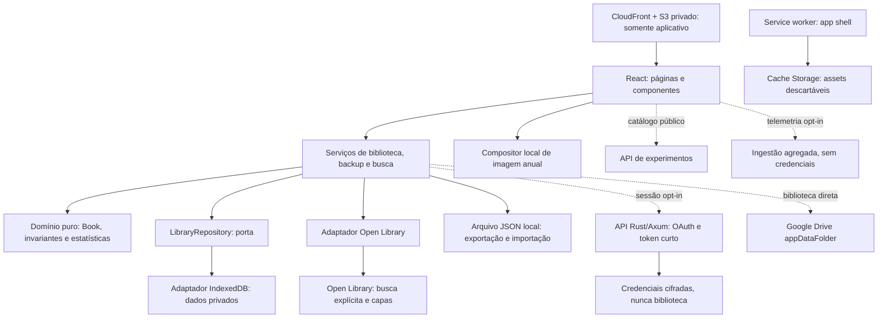

# Arquitetura técnica do Livro a Livro

**Decisão para V1 · 26 set 2026 · Estado revisto em 27 set 2026**

O Livro a Livro é uma PWA estática em React + TypeScript + Vite, com biblioteca em IndexedDB e contrato de backup JSON versionado. O núcleo local, busca, compartilhamento anual e app shell estão implementados. A API opcional Rust/Axum tem composição durável AWS na issue #13; a habilitação pública do Drive depende dos gates reais de autorização e transferência. IA permanece fora do escopo.

Este documento combina decisões de arquitetura, contratos de destino e notas de implementação por issue. A árvore proposta e os gates não afirmam que todos os arquivos, serviços AWS ou fluxos já existem. Para disponibilidade por recurso, consulte o [README](../README.md#estado-atual) e a [auditoria de maturidade de 27/09](audit-2026-09-27.md).

**Lacunas atuais:** experimentos/métricas não têm consumidores runtime. Configurações e ajuda de instalação foram entregues na issue #45. A issue #37 corrige atomicidade e validação da restauração com mídias (S1/S4); a issue #39 unifica limites de gravação, exportação e importação (S2); a issue #40 entrega a interface de backup independente (S5).

A orientação vigente inclui Drive opcional e experimentos desde a arquitetura inicial, sem tornar conta ou conexão requisitos do fluxo local. Ela substitui a exclusão histórica de Drive do roteiro visual. O [design system](design-system.md) e o [catálogo](design-system.html) continuam referências visuais, não inventário funcional.

## 1. Decisões que orientam a implementação

| Tema | Decisão V1 | Consequência |
| --- | --- | --- |
| Execução | SPA estática, sem SSR; API opcional separada | Leitura/escrita local não esperam servidor |
| Identidade | Sem conta para uso local; contrato de LOGIN persistente opcional e consentimento Drive em ações separadas | Vínculo técnico sem perfil; implantação/gates registrados no plano de paridade |
| Fonte de verdade | IndexedDB; React mantém apenas projeções e rascunhos | Sucesso de escrita somente depois do commit local |
| Fronteiras | Domínio puro → serviços → portas; adaptadores no ponto de composição | UI não conhece IndexedDB, JSON bruto nem respostas da Open Library |
| Dados portáveis | `LibraryExport` V2 para novos arquivos; leitura V1/V2, validada com Zod | Exportar e restaurar todos os anos sem rede é critério de release |
| Atualização concorrente | Revisão local e geração verificadas na transação | Uma aba antiga não sobrescreve outra nem desfaz importação |
| Estatísticas | Livros, páginas informadas e autores distintos, apenas de Lidos no ano | Filtros visuais não alteram os números |
| Busca | Botão/Enter explícito; cancelamento, deduplicação e cache limitado | Digitar não transmite consulta |
| Offline | App shell e leitura/escrita locais; capa é dispensável | Primeira visita requer rede; instalação não é backup |
| Entrega | S3 privado + CloudFront/OAC + Route 53 + ACM | Publicar assets; não hospedar bibliotecas pessoais |
| API separada | Rust/Axum para OAuth/sessão, catálogo de experimentos e telemetria opt-in | Falha do serviço desliga extras, não a biblioteca |
| Futuro | IA fora do escopo; Drive com fronteira concreta abaixo | Sem SDK de IA, chave de modelo ou cobrança antecipada |

## 2. Comparação com o BioRotina: repetir, adaptar, não trazer

**Correção de direção em 27 set 2026:** o usuário definiu paridade da mecânica de uso com o BioRotina, mantendo o design e o domínio do Livro. O [plano de paridade](paridade-biorotina.md) passa a orientar cabeçalho/conexão global, login opcional persistente, união explícita de bibliotecas e consentimentos iniciais. A entrega ocorrerá em fatias revisadas nas issues #13, #47 e #46; estes requisitos ainda não devem ser confundidos com disponibilidade em produção. O contrato de login persistente substitui a identificação temporária; a resolução por biblioteca inteira ainda será ampliada antes da liberação pública do Drive.

A comparação foi feita no checkout `/home/eflaviano/code/biodrive`, consultando `docs/architecture.md`, `docs/deployment.md`, `package.json`, `src/main.tsx`, `src/domain/data.ts`, `src/storage/indexedDb.ts`, `src/observability/client.ts`, `public/sw.js`, `.github/workflows/ci.yml`, `push/Cargo.toml` e `serverless.yml`.

**Código prevalece sobre documentação desatualizada:** o guia do BioRotina menciona backup v4; o `appDataSchema` consultado já usa v6 e o IndexedDB usa versão estrutural 3. Não copiar esses números nem considerar versões do banco e do arquivo intercambiáveis. O service worker consultado trata push e clique de notificação, sem estratégia de app shell offline: a PWA do Livro a Livro precisa implementar e testar esse cache especificamente.

| Evidência no BioRotina | Livro a Livro |
| --- | --- |
| React, TypeScript, Vite, React Router; importação de `docs/tokens.css` | **Repetir** ferramentas já declaradas e tokens como fonte única; identidade visual continua própria |
| Regras e schemas em `src/domain`; Zod para dados externos | **Repetir** validação em tempo de execução e domínio independente de React |
| IndexedDB com `idb`; salvamento condicionado a revisão/época | **Adaptar** para livros individuais e biblioteca local com vínculo explícito de Drive; manter prevenção de conflito entre abas |
| Snapshot `AppData` com registros de várias áreas e escopos Google | **Não copiar** agregado de saúde, contas, sessão, chaves Gemini ou marcadores de logout |
| Migrações de backups antigos | **Repetir** cadeia explícita, fixtures históricas e rejeição de versões futuras |
| HashRouter no cliente | **Repetir** rotas em fragmento; CDN só recebe o caminho estático, não IDs de livros |
| Manifesto, ícones e service worker para push | **Adaptar** instalação e cache offline; **não trazer** notificações, inscrição ou agendamento |
| Vitest, Testing Library, fake-indexeddb; testes de schemas e armazenamento | **Repetir** estratégia e acrescentar fluxos offline/atualização em navegador real |
| CI com validações, revisão de segredos e AWS por OIDC | **Repetir** validações e credenciais temporárias; frontend e API com testes/deploy independentes |
| S3 privado, CloudFront/OAC, Route 53 e ACM | **Repetir** topologia; recursos, permissões e origem separados do BioRotina |
| Deploy apaga assets antigos com `sync --delete` e invalida tudo | **Adaptar**: manter assets de releases anteriores e publicar HTML por último para não quebrar abas/PWAs antigas |
| Rust/Axum, API Gateway, Lambda, DynamoDB, Secrets Manager e filas | **Adaptar** só API Gateway/Lambda, OAuth, sessão, experimentos e métricas opt-in; não trazer filas/worker de snapshots. Não trazer push, cobrança, IA ou serviços de saúde |
| Sessão Google com refresh token no servidor; cliente conversa com Drive | **Repetir** a transferência PWA ↔ Drive; adaptar outbox local, retries e conflitos. O desenho depende da PWA viva e retoma automaticamente ao abrir |
| IA/Gemini, pagamentos, Firebase Analytics | **Não trazer** módulos, SDKs, segredos ou custos. Telemetria mínima própria exige opt-in separado |
| Registro tipado de experimentos, rollout, kill switch e revisão | **Adaptar**: catálogo versionado na API e atribuição local sem conta. Não copiar a coorte por conta Google nem header de force em produção |
| Eventos operacionais com enumeração de códigos, sem payload livre | **Repetir** allowlist, acrescentando agregação local e ingestão sem cookies; diagnóstico local permanece disponível sem consentir com envio |

Ter mais usuários não exige centralizar a biblioteca em AWS; quem conecta Drive autoriza transferência direta entre dispositivo e Google, sem trânsito de biblioteca pela API, conforme seção 14. A distribuição do frontend e as consultas ao fornecedor externo são dimensões diferentes de escala.

## 3. Mapa de execução e fronteiras



Regras de dependência:

- `domain/` importa apenas módulos de domínio e Zod para schemas. Sem React, DOM, `fetch`, relógio global ou IndexedDB. IDs e instante atual chegam como parâmetros às funções que criam/alteram registros.
- `services/` implementa os casos de uso e depende de domínio e portas concretas da V1. Só `app/composition.ts` instancia adaptadores; componentes recebem serviços por contexto estreito.
- `adapters/indexeddb/` conhece transações e índices. `adapters/open-library/` conhece endpoints, respostas incompletas, cache e limites. Um não importa o outro diretamente; dependências de cache são injetadas na composição.
- `ui/` gerencia rascunho, foco e apresentação. Não importa `idb`, não constrói URL de Open Library e não escreve dados em efeitos de renderização.
- `backup/` contém contrato, serialização e migrações de arquivo; `sharing/` recebe uma projeção permitida, nunca o objeto completo com notas.
- Não criar contêiner de injeção, barramento de eventos genérico, classe `BaseRepository` ou servidor falso. Manter `api/` como serviço Rust separado do frontend, sem exigir framework de monorepo. Funções e interfaces pequenas são suficientes.

### Árvore de responsabilidades proposta (não inventário do checkout)

```text
src/
  app/
    main.tsx                 # bootstrap e importação de docs/tokens.css
    composition.ts           # instancia repositório e serviços
    router.tsx               # HashRouter e rotas
    AppProviders.tsx         # serviços e estado de sessão da interface
  domain/
    book.ts                  # Book, schemas e validação
    library.ts               # ano, filtros, duplicatas e ordenação
    statistics.ts            # projeção pura de Livros/Páginas/Autores
    errors.ts                # erros tipados, sem payload pessoal
  ports/
    library-repository.ts    # leituras consistentes e commits condicionais
    book-search.ts           # SearchRequest/SearchPage, não um fornecedor genérico
  services/
    library-service.ts       # adicionar, editar, remover, consultar
    backup-service.ts        # preparar, revisar e aplicar importação
    search-service.ts        # submissão, cancelamento, cache e normalização
  adapters/
    indexeddb/
      database.ts            # nome, stores, blocked/versionchange
      migrations.ts          # evolução estrutural e de registros
      library-repository.ts
      search-cache.ts        # cache descartável e limitado
    open-library/
      client.ts              # fetch, timeout, limites, CORS e erros
      schemas.ts             # contrato tolerante a campos extras
      normalize.ts           # candidato editável, nunca Book salvo
      covers.ts              # ID validado → URL permitida / cache de imagem
  backup/
    schema.ts                # LibraryExport V1 e limites
    serialize.ts             # ordem determinística, UTF-8
    migrations.ts            # evolução do arquivo, independente do banco
    import-worker.ts         # parse/validação de arquivos sem travar UI
  sharing/
    projection.ts            # allowlist de dados que podem sair na imagem
    render.ts                # PNG Story/Quadrado, fontes e fallback locais
  pwa/
    register.ts              # disponibilidade offline e atualização segura
    service-worker.ts        # fonte do SW, manifest de assets gerado no build
  ui/
    pages/                   # ShelfPage, AddBookPage, BookPage, DataPage
    components/              # BookCard, BookList, StateBadge, Field, Dialog
    hooks/                   # useShelf, useBookDraft, useSearch
    styles/                  # layout e componentes, somente tokens semânticos
  diagnostics/
    local-report.ts          # códigos locais e preview
    telemetry.ts             # agregação allowlist, envio só com opt-in
  sync/
    coordinator.ts           # gatilhos no cliente, estado e conflitos
    outbox.ts                # pendência local durável por revisão
    api.ts                   # sessão e access token em memória
    drive-client.ts          # PWA ↔ Drive, sem proxy próprio
    snapshot.ts              # linhagem/hash/protocolo só cliente e Drive
  experiments/
    registry.ts              # chaves e variantes compiladas
    catalog.ts               # schema, validade e cache remoto
    assignment.ts            # seed local e atribuição determinística
public/
  manifest.webmanifest
  icons/
test/
  fixtures/backups/          # arquivos válidos, legados e inválidos sintéticos
  integration/              # portas, IndexedDB, concorrência e migrações
  e2e/                      # biblioteca, backup, offline e SW
infra/
  frontend.yml              # IaC da distribuição estática
  api.yml                   # API e recursos opcionais, stack independente
api/
  Cargo.toml
  src/
    bin/api.rs               # sessão e token curto, Axum/Lambda
    bin/experiments.rs       # catálogo público, sem acesso a biblioteca
    bin/telemetry.rs         # ingestão mínima, sem acesso a tokens
    auth/                    # OAuth, cookies, CSRF, consentimento
    experiments/             # configuração versionada e kill switch
    contracts/               # auth/catálogo/telemetria, nunca Book/backup
  tests/
```

Os nomes orientam responsabilidades, não obrigam a criar pastas vazias no primeiro passo. `import-worker.ts` pode compartilhar schemas puros com o thread principal. A ferramenta de PWA escolhida na etapa 7 deve gerar a lista de assets a partir do build Vite; não manter nomes de chunks manualmente. A inclusão futura de ferramenta de testes/PWA depende de instalação e lockfile revisados; esta documentação não muda `package.json`.

## 4. Modelo, identidade e invariantes

**Implementado na issue #1:** os contratos puros estão em `src/domain/`, com tipos derivados de schemas Zod estritos. `parseBook`/`parseLibrary` validam dados desconhecidos; `createBook` recebe UUID, instante UTC e ano de contexto; `updateBook` recebe alterações e instante UTC, preservando criação e recusando datas incompatíveis. `probableDuplicates` retorna avisos, sem impedir releituras. `booksForYear` filtra e ordena sem alterar a coleção recebida. Nenhuma dessas funções acessa relógio, rede, interface ou persistência.

`statisticsForYear` retorna `books`, `pages`, `authors`, `booksWithPages` e `booksWithAuthors`: páginas/autores são `null` quando há Lidos sem informação correspondente, e zero quando não há Lidos. A comparação normaliza nomes sem modificar sua grafia salva; notas preservam cada caractere como texto simples, inclusive caracteres literais de marcação, que nunca devem ser interpretados como HTML. `LIBRARY_LIMITS` reserva 1 KiB do limite de 50 MiB para o futuro envelope JSON, além de limitar a coleção a 10.000 registros. Serviços e importador deverão reutilizar essa validação antes de qualquer commit. Erros de aplicação expõem somente códigos e caminhos de campos, sem valores ou mensagens brutas do Zod. Os testes usam Vitest (`npm test`); a persistência local está descrita na seção 5, e as demais camadas continuam propostas.

Um `Book` é **um registro de leitura numa estante anual**, não uma obra global. Releitura intencional gera outro UUID. Conectar Drive não altera IDs nem cria um novo tipo de livro. ISBN e ID externo não são chave primária nem restrição de unicidade. Isso atende livros, webnovels e textos sem ISBN.

Contrato conceitual; os schemas Zod serão a fonte dos tipos na implementação:

```ts
type ReadingStatus = 'want-to-read' | 'reading' | 'read';

type Book = {
  id: string;                         // UUID criado localmente
  title: string;
  authors: string[];                   // [] significa autoria não informada
  status: ReadingStatus;
  shelfYear: number;
  pageCount: number | null;
  isbn: string | null;
  publicationYear: number | null;      // edição escolhida, quando conhecida
  startedOn: string | null;            // YYYY-MM-DD, data civil
  finishedOn: string | null;
  rating: 1 | 2 | 3 | 4 | 5 | null;
  note: string;                       // texto simples, vazio permitido
  cover: { provider: 'open_library'; coverId: number } | null;
  source: {
    provider: 'open_library';
    workId: string | null;
    editionId: string | null;
    retrievedAt: string;              // instante ISO em UTC
  } | null;
  createdAt: string;                  // instante ISO em UTC
  updatedAt: string;
};

type LibraryExport = {
  format: 'livro-a-livro';
  schemaVersion: 2;
  exportedAt: string;
  books: Book[];
  preferences: { shelfYear: number | null; filter: ReadingStatus | 'all' };
};
```

`source` só documenta origem; título, autores e demais campos continuam editáveis. A versão inicial não salva payload bruto do fornecedor, sinopse remota, conta ou histórico de consultas no backup. `cover` é referência opcional da Open Library ou ausente. O campo opcional de capa do roteiro não implica upload de arquivos, URLs arbitrárias ou editor de imagens na V1. Cache de pixels é descartável; JSON preserva a referência, não garante que o fornecedor continuará entregando a imagem.

Invariantes a testar:

1. `title` tem 1–500 caracteres após aparar bordas; autores têm até 200 caracteres cada, no máximo 20, sem entradas vazias ou duplicatas por normalização. `note` aceita até 20.000 caracteres sem HTML e **sem aparar nem normalizar silenciosamente** o texto já salvo/importado.
2. Ano da estante: inteiro de 1 a 9999, padrão do ano em contexto. Ano de publicação é independente e opcional no mesmo intervalo; não inventar ano desconhecido. Exibir anos em quatro dígitos quando necessário.
3. Datas civis são calendariamente válidas, preservadas como texto, sem conversão automática de fuso. `startedOn ≤ finishedOn` quando ambas existem. Quero ler não tem datas; Lendo permite início; Lido permite início e término. O cadastro atual não oferece campos de datas; registros antigos mantêm as datas ao editar. Se novo estado ou ano as tornar incompatíveis, confirmar sua remoção antes de salvar.
4. Término, se informado, deve pertencer ao ano da estante. A UI oferece corrigir o ano ou a data; o domínio recusa inconsistência. Início pode ser no ano anterior. Lido sem data continua válido.
5. `pageCount` é inteiro positivo até 1.000.000 ou `null`; zero não representa ausência. Limite é proteção técnica, não classificação de um livro. Não estimar páginas de uma obra por mediana de edições.
6. ISBN é opcional, normalizado sem espaços/hífens, validado por tamanho e dígito verificador de ISBN-10/13. Conteúdo sem ISBN não recebe identificador inventado. Importação não reescreve silenciosamente ISBN inválido.
7. Avaliação é inteiro 1–5 ou `null`, independente de estar Lido. Nota é sempre privada. Ausência de avaliação não equivale a zero.
8. `createdAt` e `updatedAt` são instantes válidos. Ao editar, preservar criação e usar `max(instante atual, updatedAt anterior)` para não regredir por relógio local; horários não resolvem conflitos. Importação preserva os valores e recusa `updatedAt < createdAt`.
9. IDs de registro são únicos dentro do arquivo/banco. IDs externos aceitam apenas padrões OL de obra/edição, e `coverId` é inteiro positivo seguro. Nada disso precisa de chamada de rede para validar.
10. Provável duplicata: título e autoria normalizados mais ano, ou edição/ISBN coincidente no mesmo ano. Aviso com possibilidade de continuar; não proibição de homônimos ou releituras.
11. Limites iniciais de proteção: até **10.000 registros e 50 MiB de JSON UTF-8** por biblioteca. Aplicar os mesmos limites a cadastro, edição e importação antes do commit; manter margem para o envelope de exportação. Nenhuma escrita aceita pode produzir biblioteca que o próprio importador rejeite. Ajustar limites só com teste de desempenho e compatibilidade, sem truncar dados existentes.

### Estatísticas e visualização

`statisticsForYear(books, year)` usa apenas `status === 'read' && shelfYear === year`:

- **Livros:** número de registros, incluindo releituras distintas.
- **Páginas:** soma de `pageCount` conhecido; mostrar “páginas informadas” e a cobertura (“em 12 de 20 livros”) quando houver valores ausentes. Nunca transformar ausência em uma afirmação de zero páginas lidas.
- **Autores:** união dos nomes com NFKC, trim, espaços internos compactados e caixa normalizada para comparação; preservar nomes originais para exibição. Não usar fuzzy matching nem alegar resolver pseudônimos/homônimos. Sem autoria, aquele registro não acrescenta um autor “desconhecido”.

Ano vazio mostra 0 livros; se há lidos e nenhuma página/autoria informada, usar “Não informado” nos dois indicadores, com contexto acessível. A distinção complementa a regra de não estimar do design system. Os filtros Quero ler/Lendo/Lido, modo Grade/Lista e a posição de rolagem não alteram as estatísticas. Ordenação: `createdAt` decrescente e `id` como desempate estável.

## 5. IndexedDB e porta de persistência

**Implementado na issue #2:** `src/ports/library-repository.ts` define a porta e `openLibraryRepository`, em `src/adapters/indexeddb/`, abre o adaptador V1. A composição futura deve guardar a revisão recebida na leitura, fornecê-la em `commit` e chamar `close` ao descartar o adaptador. `subscribe` avisa mudanças confirmadas; o adaptador relê metadados ao receber aviso de outra aba ou foco da janela. Hosts diferentes podem chamar `checkForChanges`. Falhas nessa observação chegam ao callback opcional `onObservationError`; `onDatabaseEvent` distingue `blocked`, `versionchange` e encerramento inesperado, sem detalhes privados. As notificações são auxiliares: uma transação continua recusando revisão vencida mesmo sem canal.

Os metadados V1 contêm `generation`, `revision`, `recordVersion`, `bookCount` e `serializedBytes` (array JSON em UTF-8, incluindo colchetes/vírgulas e excluindo o envelope reservado). Escritas individuais calculam deltas na transação; substituições validam e calculam o total antes dela. A chave externa de `books` é o UUID em minúsculas; o valor preserva a grafia original do ID. Isso mantém a identidade sem distinguir caixa e permite restaurar os valores originais. Ao abrir, livros, chaves e metadados são validados; corrupção impede expor um repositório gravável, sem reparo ou limpeza automática.

Preferências usam `shelfYear: null` até haver escolha/contexto, `mode: 'grid'`, `filter: 'all'` e `lastExport: null`. `lastExport` agrupa instante do download iniciado e revisão exportada. `updatePreferences` mescla somente os campos recebidos numa transação própria, preservando alterações concorrentes em outros campos; o último commit vence quando duas abas alteram o mesmo campo. Ano e filtro incrementam a revisão e o outbox quando mudam; modo Grade/Lista fica no IndexedDB local sem revisão, outbox ou aviso de conteúdo ao sync. O modo avisa outras abas por um evento local sem valor no payload e é relido no foco. `replace` preserva o modo atual dentro da própria transação, inclusive se ele mudar após uma prévia; substitui apenas ano/filtro portáteis e limpa `lastExport` quando fornecidos.

A criação V1 é a única migração de produção existente. Upgrades futuros devem acrescentar passos explícitos em `migrations.ts`; falhas abortam integralmente. Uma abertura bloqueada falha com `StorageUnavailable` e evento `blocked`; sua requisição pendente será abortada quando puder prosseguir, impedindo migração tardia depois de o chamador receber erro. Nunca há downgrade nem exclusão automática. `syncState`, `syncOutbox`, `experimentState` e `searchCache` usam estruturas isoladas. A etapa de experimentos usa `experimentState` apenas para consentimentos, seed local e atribuições; não entra no backup, no Drive ou na API. O índice de cache é `byAccess` sobre `lastAccessedAt`.

`npm test` executa domínio e integração com `fake-indexeddb` (dependência apenas de desenvolvimento). As fixtures são sintéticas; testes injetam quota/abortos e simulam uma próxima versão estrutural para exercitar bloqueio e rollback de migração. Quota real, eviction e ciclo de vida entre abas em navegadores continuam como gates de integração do shell/PWA; o emulador não comprova essas condições reais.

Banco `livro-a-livro`, versão estrutural inicial `1`. Proposta de stores:

| Store | Chave / índices | Conteúdo |
| --- | --- | --- |
| `books` | `id`; índice `byShelfYear`; índice composto `byYearStatus` | `Book`, um registro por chave |
| `meta` | chave fixa `library` | geração UUID, revisão inteira, versão de registros e tamanho serializado calculado |
| `preferences` | chave fixa `ui` | ano/modo/filtro; última exportação iniciada e revisão exportada |
| `syncState` | chave do vínculo opaco | base remota, hash local confirmado, geração do consentimento e revisão pendente; sem token Google |
| `syncOutbox` | ID de operação aleatório | snapshot/revisão preparada ou marcador de alteração a preparar; durável e limitado a uma pendência atual por vínculo |
| `experimentState` | chave local | seed nunca transmitida, consentimentos independentes, coortes e catálogo com validade |
| `searchCache` | chave normalizada de consulta+página+idioma+versão de adaptador; índice de acesso | candidatos temporários, validade e tamanho; sem nota/avaliação |

Não guardar biblioteca em `localStorage`. Cache Storage cuida de assets/capas, nunca de `Book` ou backups. Preferências, cache, syncState/syncOutbox e experimentState não entram no backup: restaurar livros não deve sobrescrever preferências do aparelho nem produzir histórico de buscas portátil.

Porta mínima:

```ts
type LocalRevision = { generation: string; revision: number };
type Snapshot = { books: Book[]; version: LocalRevision };
type LibraryChange =
  | { kind: 'put'; book: Book; coverMedia?: CoverMedia }
  | { kind: 'delete'; id: string }
  | { kind: 'replace'; books: Book[]; preferences?: PortablePreferences; coverMedia?: CoverMedia[] };

interface LibraryRepository {
  readAll(): Promise<Snapshot>;
  readYear(year: number): Promise<Snapshot>; // versão e livros na mesma transação
  readBook(id: string): Promise<{ book: Book | null; version: LocalRevision }>;
  commit(change: LibraryChange, expected: LocalRevision): Promise<LocalRevision>;
}
```

O adaptador valida pré-condições essenciais, compara `expected` e escreve `books` + `meta` numa única transação `readwrite`. Com Drive autorizado, a mesma transação marca a revisão pendente em `syncOutbox`; a confirmação local independe do envio. Toda mudança incrementa revisão; substituição integral também gera nova geração. Banco recém-criado ganha geração nova, portanto uma aba antiga não coincide com revisão reiniciada após limpeza. Limites de volume fazem parte da validação transacional; metadados de tamanho podem ser atualizados por delta de bytes serializados, com recomputação em migração/importação. Não confiar em tamanho fornecido pelo arquivo.

Só resolver `commit` após `tx.done`. Não aguardar fetch, leitura de arquivo, Worker, hash ou diálogo dentro de uma transação IndexedDB: preparar e validar antes, depois manter a transação curta. A conclusão da transação é a confirmação que a API oferece, não uma promessa contra remoção pelo usuário, falha física ou eviction. O ciclo de vida de transações é descrito na [documentação IndexedDB](https://developer.mozilla.org/en-US/docs/Web/API/IndexedDB_API/Using_IndexedDB).

`BroadcastChannel` comunica apenas “revisão mudou”, sem livros ou notas. Outras abas invalidam projeções; ao recuperar foco, comparar metadados também, como fallback. A transação continua sendo a garantia, não o broadcast. Se um formulário tem rascunho, preservar o texto e informar alteração externa; nunca salvar automaticamente por cima. Por simplicidade, a V1 usa revisão da biblioteca inteira: edições simultâneas em livros diferentes podem pedir nova revisão; otimização por registro só se esse atrito for demonstrado.

Erros tipados: `StorageUnavailable`, `QuotaExceeded`, `StaleRevision`, `UnsupportedVersion`, `InvalidBackup`, `ImportTooLarge`. A UI traduz para pt-BR e mantém o rascunho; detalhes do navegador não aparecem nem são enviados como diagnóstico padrão.

## 6. Fluxos de dados

### Adicionar, editar e remover

**Implementado na issue #6:** `createLibraryService` concentra criação/edição pelo domínio, aviso de duplicata e commits condicionais. A interface captura a revisão ao abrir o formulário e mantém o rascunho diante de quota/falha/conflito; recarregar uma versão salva exige confirmação de descarte. Datas incompatíveis continuam visíveis após trocar o estado, para correção explícita. Cadastro começa no ano selecionado, com Quero ler e título obrigatório; os demais detalhes são opcionais. A página lê pelo ID, exibe nota como texto simples, permite editar e confirma exclusão em diálogo com foco contido, Escape e retorno ao acionador. A confirmação conserva a revisão apresentada mesmo se outra operação alterar o banco. Capas continuam sendo fallbacks locais e nenhum fluxo desta etapa faz chamadas de rede. Testes de serviço e interface usam IndexedDB emulado, incluindo ausência de `fetch`; validação visual e de ciclo de vida em navegador real permanece um gate posterior.

1. UI mantém rascunho e a revisão da leitura inicial; relógio/UUID são fornecidos pelo serviço.
2. Serviço valida domínio, datas, duplicata e limites; confirmação de exclusão/descarte acontece antes do commit.
3. Repositório compara geração/revisão e faz a mudança atômica.
4. Após commit, invalidar consultas locais, anunciar “Livro salvo neste dispositivo” e atualizar a interface. Se há vínculo Drive, o coordenador drena a outbox automaticamente sem bloquear o formulário.
5. Em quota, conflito ou erro: não navegar nem apagar rascunho. Oferecer tentar novamente; em conflito, reler e reconciliar conscientemente antes de novo envio.

Não usar salvamento otimista para afirmar persistência. Não manter um efeito global que grave um snapshot antigo a cada renderização, erro especialmente perigoso após importação.

### Abrir estante e livro

**Implementado na issue #5:** a composição abre o adaptador IndexedDB e oferece um serviço de projeção local à interface. A estante reutiliza as funções puras de ano/ordenação/estatísticas; as rotas Lendo e Quero ler mantêm o mesmo ano e as métricas dos Lidos. Inicialização e falha não exibem uma estante vazia antecipadamente. Revisões publicadas pelo repositório (incluindo observação por foco) recarregam um snapshot consistente com preferências; respostas antigas são descartadas. Modo, ano e filtro são gravados por patches serializados sem sobrescrever livros/histórico de exportação; desde a issue #92, ano/filtro avançam revisão e modo permanece local sem revisão. Preferências são compartilhadas no dispositivo: uma reconsulta pode incorporar as gravadas por outra aba; interações locais em curso têm prioridade sobre a leitura iniciada antes delas. Falhas dessas preferências recebem aviso, sem sucesso fictício de persistência. Retorno do livro preserva contexto e posição em memória nesta sessão. Nesta etapa todas as capas são fallbacks tipográficos locais; carregamento externo/cache pertence à integração Open Library (#7).

1. Abrir banco e checar versão compatível; estado de carregamento não mostra biblioteca vazia prematuramente.
2. Ler ano + versão numa transação consistente, calcular métricas a partir de todo o ano e aplicar filtro apenas à coleção visível.
3. Renderizar capa local/cache ou fallback; nenhuma busca bibliográfica ao montar um livro.
4. Página do livro lê por ID. ID ausente mostra mensagem e retorno à estante, sem criar registro vazio.

Usar HashRouter com `#/estante`, `#/adicionar`, `#/livro/<uuid>` e `#/dados`. Ano/filtro/modo/rolagem podem ficar no estado de navegação e preferências; títulos, notas e consultas não entram na URL. Fragmentos não são enviados na requisição HTTP, mas continuam visíveis a scripts da origem e no histórico: não são um mecanismo de sigilo.

**Navegação e busca local — issues #44, #79 e #91:** abaixo de 1024 CSS px o shell usa Estante/Adicionar/Mais; desktop mantém lateral. Mais reúne Seus dados, Configurações e Instalar em linhas curtas; Apoiar permanece no cabeçalho. O destino Instalar mostra estado curto quando já instalado. Links passam pelas guardas de rascunho e backup existentes. A consulta de título/autoria vive exclusivamente no `LibraryProvider` em memória e filtra a projeção já carregada, após ano/estado. A estante pagina essa projeção em lotes de 24 após ano, estado e busca; métricas usam o ano completo e a busca examina todos os resultados, inclusive os que não estão renderizados. A página fica em memória por rota e seleção, reinicia quando ano/filtro/consulta mudam, é limitada ao total após remoção/edição e acompanha a posição ao voltar do detalhe. Paginar não altera preferências portáveis, biblioteca, JSON/Drive, rede, URL ou telemetria. Detalhe/retorno preservam consulta, ano, filtro, modo e posição durante a sessão; recarregar encerra a consulta. Resultados externos continuam explícitos e revisão antes do commit.

### Busca e enriquecimento

Submeter consulta → cache/limite → fetch abortável → validar resposta → candidatos → escolher um → normalizar revisão editável → salvar pelo mesmo serviço de cadastro manual. Seleção não faz commit; atualização externa nunca modifica um registro já salvo automaticamente. A interface conserva consulta e resultados ao abrir a revisão de um candidato, para permitir voltar à lista sem nova consulta. Ao entrar no formulário, operações de busca ainda pendentes são canceladas; um rascunho alterado exige confirmação antes de descarte.

### Exportar e importar

Exportar: snapshot consistente → validação → serialização determinística → Blob JSON → download iniciado. Importar: arquivo local → limite → parse/validação em Worker → migração do formato → resumo imutável → exportação opcional da biblioteca atual → confirmação → commit de substituição condicionado à revisão → reconsulta. Detalhes e recuperação estão abaixo.

## 7. Backup JSON, migrações e recuperação

### Contrato portátil V2 (leitura V1 preservada)

`LibraryExport` contém todos os anos, inclusive notas, avaliações, datas, UUIDs e referências de capa. **Contrato atual da issue #92:** novos arquivos V2 incluem apenas preferências portáteis (`shelfYear`, `filter`). Arquivos V1 com `mode` continuam aceitos, mas a restauração preserva o modo atual do dispositivo. Não inclui cache, diagnósticos, geração/revisão local, credenciais ou campos derivados. O histórico `lastExport` é local: referencia uma geração/revisão do dispositivo e é zerado na restauração, evitando afirmar um download que não ocorreu ali. Ordem de `books` é por `id`, campos têm ordem definida pelo serializer, UTF-8 com JSON válido e newline final. Preservar ordem de autores e todos os valores semânticos; `exportedAt` naturalmente muda a cada exportação. O teste compara os livros por ID/campo, não os bytes dos dois envelopes.

**Implementado nas issues #3 e #92:** `src/backup/` valida envelopes estritos V1/V2, recusa versões futuras e serializa de forma determinística. `createBackupService` prepara um arquivo local, fornece prévia imutável com contagens/anos atuais e recebidos, e confirma uma única substituição condicionada à revisão. Selecionar outro arquivo ou cancelar invalida a prévia anterior. Livros e preferências são lidos/exportados consistentemente e restaurados na mesma transação. O serviço gera Blob/nome de arquivo. A issue #40 conecta a UI em Seus dados, que inicia download e registra esse início separadamente. A composição real injeta um Worker descartável para parse/migração/validação; o parser padrão síncrono continua disponível para testes de serviço. Não há upload.

Exemplo mínimo válido:

```json
{
  "format": "livro-a-livro",
  "schemaVersion": 2,
  "exportedAt": "2026-09-26T15:00:00.000Z",
  "books": [],
  "preferences": { "shelfYear": null, "filter": "all" }
}
```

Nome: `livro-a-livro-AAAA-MM-DD.json`. O texto de confirmação é **“Arquivo JSON gerado. Confira se ele foi salvo.”** Histórico registra “exportação iniciada”, instante e revisão, sem declarar cópia concluída. Falha ao registrar esse histórico não muda a biblioteca nem invalida o arquivo que já foi gerado.

### Validação e aplicação

- Ler `File.size` antes de `text()`/Worker; limite 50 MiB. Recusar arquivo maior, excesso de registros, profundidade/estruturas fora do contrato e campos desconhecidos. JSON é dado, nunca código; não usar `eval`, merges arbitrários ou `dangerouslySetInnerHTML`.
- Validar envelope estrito e cada registro com schema da versão declarada. UUID repetido é erro; título repetido não é. Versão futura recusa com mensagem para atualizar o app, sem reinterpretar como V1 nem descartar campos.
- Limites atingidos não autorizam truncar notas/autores ou importar parcialmente. Worker devolve dados validados ou códigos públicos de erro, sem mutar IndexedDB; o serviço revalida sua resposta, prepara mídia e produz contagens/anos imutáveis; pessoa pode cancelar até iniciar o commit.
- Prévia usa a mesma coleção validada que será aplicada, mantida imutável. Arquivo alterado/selecionado novamente invalida a prévia. Se outra aba mudar a biblioteca após prévia, reabrir confirmação com dados atuais; não repetir destrutivamente em segundo plano.
- `replace` compara geração/revisão, substitui `books` e `coverMedia`, aplica preferências fornecidas e atualiza `meta` e `syncOutbox` na **mesma transação**. Omissão de `coverMedia` significa coleção vazia, preservando backups V1 anteriores às capas. Qualquer erro aborta tudo. Só depois da conclusão anunciar importação e descartar projeções antigas. A confirmação final informa quantos registros serão removidos/substituídos; importação de biblioteca vazia requer o mesmo cuidado.
- Oferecer exportar a atual antes de substituir, sem marcar download como terminado. Não criar mesclagem automática, resolução por data ou cópia oculta permanente na V1.
- O backup é texto legível. Não prometer criptografia, autenticação do arquivo ou proteção contra arquivo adulterado mas estruturalmente válido. Mostrar a origem local selecionada e resumo para decisão; não enviar arquivo a serviço algum.

### Três versões independentes

1. **Release do aplicativo**: build/commit para suporte e rollback.
2. **Versão estrutural IndexedDB**: stores/índices e transformações locais no upgrade.
3. **`schemaVersion` do JSON**: contrato portátil; migrações puras `vN → vN+1`, com fixtures permanentes.

O importador atual aceita apenas V1, com `coverMedia` opcional na entrada para compatibilidade com arquivos anteriores à inclusão de capas. Ao adicionar V2, continuar importando V1 por migração explícita; não descartar um arquivo antigo porque o banco já foi atualizado. Migrações não fazem rede nem inferem conteúdo pessoal. Em `versionchange`, fechar conexão e pedir recarga; em `blocked`, orientar fechar outras abas, sem apagar o banco.

Mudança estrutural pequena usa transação de upgrade e aborto integral em falha. Mudança de dados destrutiva exige exportação prévia orientada e plano testado de recuperação; antes de migrar, o app antigo ainda deve conseguir exportar. Se banco estiver em versão mais nova que o bundle, bloquear escritas e pedir versão compatível; não tentar downgrade ou recriar banco vazio.

### Recuperação por tipo de falha

| Falha | Resposta |
| --- | --- |
| Navegador negou persistência | Manter rascunho em memória, explicar limitação; não oferecer “modo salvo” baseado só em RAM |
| Quota insuficiente | Limpar primeiro caches descartáveis, não livros; oferecer exportação e tentar novamente |
| Importação falhou | Transação abortada, biblioteca anterior intacta e arquivo original preservado |
| Registro local não valida | Entrar em modo de recuperação sem regravar; oferecer baixar dump técnico separado, marcado como não sendo backup V1 validado |
| Migração falhou | Abortar, manter banco anterior e mostrar código local; não resetar dados automaticamente |
| Navegador apagou/expulsou dados | Explicar restauração por JSON; sem Drive conectado não há recuperação remota automática |
| Release defeituoso | Reverter somente para bundle compatível com versão do banco; caso contrário, correção adiante |

`navigator.storage.estimate()` orienta uso aproximado; `persist()` pode ser solicitado após explicar o benefício em Seus dados, tratando suporte/negação normalmente. Nem persistência concedida impede limpeza manual. Essas limitações variam por navegador, conforme [quotas e eviction](https://developer.mozilla.org/en-US/docs/Web/API/Storage_API/Storage_quotas_and_eviction_criteria).

## 8. Open Library: uso responsável, cache e limites

**Implementado na issue #7 e ampliado nas #67/#69:** a página Adicionar oferece busca explícita e cadastro manual. `BookSearch`/`createSearchService` cancelam consultas ao sair, deduplicam submissões e descartam respostas antigas. O adaptador consulta `https://openlibrary.org/search.json`, com campos permitidos, 20 resultados por página e ISBN válido normalizado no parâmetro `isbn`. Ao escolher um resultado com edição identificada, consulta apenas essa edição em `/books/{id}.json`, pela mesma fila e limite. Respostas têm teto de 2 MiB, timeout de 10 segundos e normalização; nenhuma resposta bruta vira registro salvo. O formulário local permite revisar antes do commit. O título e a capa vistos na lista permanecem no cadastro; a capa da edição só é usada quando o resultado não tem uma. Ano, páginas e ISBN da edição têm prioridade; quando a edição não informa ano, o primeiro ano da obra preenche o ano de publicação. Campos ausentes continuam vazios.

**Issue #103:** uma ação de pesquisa externa abre `books.google.com` após clique explícito, usando somente o texto do campo e sem enviar livros, notas ou outros registros. Esse caminho não usa a Books API, chave, proxy, cache nem conversão automática de resultados Google em livros locais. A URL é criada no handler do botão, fora dos links rastreados pelo Analytics, e a nova guia usa `noreferrer`; a estante continua operável sem essa ação. A avaliação de uma integração embutida e seus limites de licença, quota e atribuição está em [google-books-feasibility-2026-09-29.md](google-books-feasibility-2026-09-29.md).

O store reservado `searchCache` guarda somente páginas normalizadas e os prazos técnicos de limite, sem ler `books`, participar do backup ou enviar diagnóstico. Cache válido dura 24 horas (5 minutos vazio), com LRU de 100 entradas/5 MiB; vencido é descartado, sem reaproveitamento nem revalidação oculta nesta fatia. Uma transação compartilha o intervalo de 1.100 ms e o cooldown 429/503 entre abas. Falha de cache de resultado não impede buscar; falha do limitador bloqueia a busca externa e mantém o cadastro manual. Retry sempre depende de clique.

Os resultados mostram capas pequenas por `coverId` validado, com carregamento tardio, CORS anônimo, sem referrer e fallback local. “Selecionar” carrega a edição antes de abrir o formulário; falha permite tentar novamente ou seguir apenas com os dados da obra. A referência de capa permanece no livro. O fornecedor pode redirecionar imagens de `covers.openlibrary.org` para `archive.org` e hosts de mídia `*.us.archive.org`; a CSP de produção permite esses destinos apenas em `img-src`. Não há proxy nem service worker adicional para a busca. Os testes automatizados usam respostas sintéticas, sem acessar o serviço público.

**Capas locais adicionadas na issue #21:** o domínio aceita `provider: 'local'`, os bytes ficam em `coverMedia` e o detalhe mostra a imagem enviada. A issue #42 reutiliza essa mídia também na estante, com leitura local assíncrona e fallback seguro. Backup e sincronização carregam mídias; a issue #37 corrige a substituição atômica e a validação prévia. A issue #39 unifica limites e coleta de órfãs na transação de escrita. Capas não passam pela API/AWS.

O provedor publica limites de **1 requisição/s sem identificação e 3/s com identificação**, pede cache e uso humano de baixo volume, e não se propõe a servir como backend de alto tráfego. Não distribuir tráfego deliberadamente por IPs para contornar limites. Revalidar essas regras antes do lançamento e de cada expansão relevante. [Diretrizes oficiais](https://openlibrary.org/developers/api).

A chamada direta do navegador não garante cabeçalho `User-Agent` customizado nem elegibilidade à cota identificada. Não assumir 3/s, não inserir e-mail de usuário em URL, não usar `no-cors` como solução. Antes de abrir a busca publicamente em escala, apresentar o modelo distribuído do app à Open Library e esclarecer identificação/volume permitidos; “cada pessoa usa seu IP” não é justificativa para exceder capacidade agregada. Não foi feito contato nesta tarefa.

### Política inicial do cliente — decisões do projeto

| Aspecto | Regra inicial |
| --- | --- |
| Gatilho | Botão Buscar ou Enter; nenhuma chamada no `onChange` |
| Entrada | Trim, normalização de espaços, 2–200 caracteres; ISBN normalizado em pesquisa apropriada |
| Debounce | Apenas filtro local pode usar 150 ms; busca externa **não usa debounce de digitação**. Submissões repetidas são deduplicadas; futura busca automática exigiria outra decisão de privacidade |
| Concorrência | Uma requisição bibliográfica em voo; intervalo mínimo de 1.100 ms entre inícios por origem, inclusive tentativas canceladas |
| Várias abas | Coordenar concessão do próximo horário em transação curta no cache local; BroadcastChannel ajuda a invalidar, não substitui o lock transacional |
| Paginação | 20 resultados/página; próxima página só por gesto, sem pré-busca infinita |
| Resposta | `fields` explícitos, sem `*`/availability; teto de resposta 2 MiB com leitura limitada do corpo, não só confiar em Content-Length |
| Cancelamento | `AbortController` ao substituir busca/sair da página; timeout de 10 s; sequência de request impede aplicar resposta antiga mesmo após aborto |
| Retry | Nenhum retry automático na V1; mostrar “Tentar novamente”, respeitando cooldown |
| 429/503 | Respeitar `Retry-After` quando exposto por CORS; caso ausente/inacessível, cooldown de 60 s. Persistir apenas prazo técnico entre abas; nova tentativa depende da pessoa |
| Demais erros | Sem rede/timeout/CORS/JSON inválido têm mensagem e cadastro manual; cancelamento voluntário não é erro |
| Cache | IndexedDB descartável, TTL de 24 h para sucesso e 5 min para resultado vazio; até 100 entradas ou 5 MiB, LRU |
| Privacidade do cache | Consultas podem revelar interesses: ficam somente nesta origem, não entram no backup/diagnóstico e podem ser apagadas em Seus dados |
| Offline | Exibir cache válido identificado como resultado salvo; cache vencido exige aviso/data e escolha explícita de usar, sem revalidação oculta |

TTL, tamanho e timeout acima são parâmetros internos, não garantias do fornecedor. O limitador local não controla outras aplicações no mesmo IP nem o tráfego total do projeto. Não fazer teste de carga no serviço público. Cadastro manual permanece plenamente utilizável se a busca precisar ficar indisponível durante revisão de capacidade.

Busca: `search.json` com `q` ou `isbn`, `lang=pt`, `page`, `limit` e `fields=key,title,author_name,cover_i,first_publish_year,editions,editions.key`. Montar via `URLSearchParams`; nunca concatenar consulta crua. Uma chave de edição validada permite consultar `/books/{id}.json` somente após a escolha. O primeiro ano da obra serve como fallback explícito para o ano do formulário; páginas e ISBN nunca são estimados. [Search API](https://openlibrary.org/dev/docs/api/search), [Books API](https://openlibrary.org/dev/docs/api/books) e [AbortController](https://developer.mozilla.org/en-US/docs/Web/API/AbortController).

### Capas e imagem anual

A issue #42 usa URL construída de `coverId` validado em `covers.openlibrary.org`, tamanho M para tela e fallback tipográfico em falta/erro/offline. A issue #67 acrescenta tamanho S à lista de busca; imagens usam lazy loading nativo. Cache raster próprio, limites de 50 MiB/200 entradas/30 dias e fila explícita de concorrência permanecem trabalho futuro; esta entrega usa somente o comportamento de cache/lazy loading do navegador. Não consultar capa por ISBN repetidamente: a API tem regras específicas para tipos de identificador; CoverID/OLID evitam o caminho limitado documentado, mas não autorizam tráfego irrestrito. [Covers API](https://openlibrary.org/dev/docs/api/covers).

Na renderização atual, `` omite credenciais entre origens e referrer. Numa futura camada de cache raster, preferir `fetch` CORS com `credentials: 'omit'` e `referrerPolicy: 'no-referrer'`, validar imagem raster e tamanho antes de cachear. Se CORS ou origem final não permitir leitura, usar fallback: não cachear respostas opacas como se fossem bytes verificados nem inventar proxy V1. Na estante e no detalhe, mostrar informação de que capas externas usam rede; offline não criar a imagem remota. Restaurar JSON preserva referência e texto, mas capas não cacheadas podem faltar offline.

Para compartilhar, criar `ShareYear` com ano, quantidade e até seis títulos/autores/capas permitidos; nota, rating, UUID e metadados técnicos nem chegam ao renderer. Usar blobs legíveis/cache e fallback local no Canvas para evitar canvas contaminado por imagem sem CORS. Gerar PNG 1080×1920 ou 1080×1080, respeitando margens do design system. Não pedir tamanho maior de capa só para exportar: o preview usa os mesmos assets disponíveis. Prévia antes do download, descrição textual copiável e revogação dos Object URLs ao encerrar. Exportar PNG não atualiza estado de backup JSON.

## 9. PWA, cache e atualização segura

PWA é instalada na **mesma origem canônica** da biblioteca. Subdomínio, porta ou protocolo diferente cria outro armazenamento; staging não compartilha IndexedDB com produção. Escolher a origem definitiva antes do primeiro uso público e fornecer JSON como caminho de mudança de domínio.

- Manifesto com `id`, `start_url` e `scope` estáveis em `/`, nome Livro a Livro, tema vindo da paleta, ícones normais/maskable e modo standalone. Instalação varia por plataforma; o site continua funcional sem instalabilidade.
- Precache gerado no build: HTML, CSS, JS inicial, chunks lazy usados offline, fontes/ícones locais e página de fallback. Instalação do cache deve ser completa antes de marcar “Disponível offline”; primeira visita sem rede não funciona.
- Cache de navegação: shell compatível com o release ativo. Assets hashados usam cache-first. Somente requisições same-origin GET previstas entram no cache de app shell; JSON de usuário não é requisição HTTP nem entra no SW.
- Busca bibliográfica é administrada pelo adaptador; não adicionar um segundo cache/retry no SW. Cache de capas é separado e dispensável. Remover só caches com prefixo do aplicativo, nunca toda Cache Storage ou IndexedDB.
- Novo SW instala em espera. Pela decisão de 27 set 2026, aplicar automaticamente na abertura somente antes de qualquer interação, depois da inicialização local/sync e da montagem dos bloqueios da interface. Se adiado, mostrar ação no topo. Não usar `skipWaiting`/reload incondicional enquanto há edição, diálogo, importação/exportação, gravação de preferências ou operação de sync em andamento.
- Coordenar atualização entre abas: adiar ativação se alguma sessão conhecida tem rascunho ou operação ativa; se não for possível confirmar, orientar fechar as outras abas. Manter assets antigos e compatibilidade de leitura/escrita durante a transição; `controllerchange` sozinho não prova ativação do worker selecionado; somente uma tentativa desta aba, ainda segura, pode recarregá-la.
- Falha de cache não apaga biblioteca e não impede uso online. Mensagens diferenciam “Salvo neste dispositivo” de “Disponível offline”. Não depender de push, Background Sync ou Periodic Background Sync para garantir sincronização: a API não recebe biblioteca e a sincronização retoma com a PWA viva. Ver seção 14.

**Configurações/instalação — issues #45, #76 e #97:** ano (inclusive automático), modo e filtro usam `updatePreferences` do serviço existente na estante; mudanças de ano/filtro avançam a revisão da biblioteca, enquanto modo é local ao dispositivo. Ano automático usa `shelfYear: null`, distinto da seleção fixa do ano corrente. Falha mantém escolha da sessão, explica ausência de persistência e permite retry na estante. Configurações reúne a revisão da escolha conjunta de visitas e diagnóstico, versão/build públicos e estado offline; atualização manual e instalação são ações secundárias. Versão do package e commit público de 12 caracteres são incorporados no build (fallback `local` sem Git); não são identificadores de instalação nem dados da pessoa.

O observador de instalação captura `beforeinstallprompt` desde o boot, consome cada evento uma vez, espera gesto explícito e distingue aceite/cancelamento/falha de instalação observada (`appinstalled`, display standalone ou marcador Safari). Nenhuma instalação é solicitada automaticamente. A identificação do navegador apenas seleciona a instrução em destaque: não promete o prompt. Detecção incerta mostra todas as instruções; o estado instalado dispensa instruções. Instruções seguem [Chrome Android](https://support.google.com/chrome/answer/9658361?co=GENIE.Platform%3DAndroid&hl=pt-BR) e [Safari no iPhone](https://support.apple.com/pt-br/guide/iphone/iphea86e5236/ios); os rótulos variam por versão. O contrato do evento está em [MDN](https://developer.mozilla.org/en-US/docs/Web/Progressive_web_apps/How_to/Trigger_install_prompt).

**Regressão real encontrada nesta etapa:** Vite preview envia `Vary: Origin`; requisições nativas de módulos incluem Origin, enquanto o precache por URL não inclui. O lookup exato ignorava bytes presentes e buscava chunks antigos removidos, recebendo HTML em vez de JS. Leituras dos caches públicos próprios usam `ignoreVary: true`, inclusive fallback de releases anteriores. A exceção se limita aos assets públicos precacheados com integridade e credenciais omitidas; os gates de Authorization, query, método e origem permanecem. Não cria cache de dados privados nem altera política de rede. Teste modela Origin nativo e Vary em release atual/anterior sem rede.

Uma atualização exige `waiting` distinto de um `active` já ativado. Primeira instalação e ativação externa nunca forçam recarga. Há uma oportunidade automática por abertura, limitada à verificação inicial e ao worker que ela instala; interação do usuário encerra essa oportunidade. Verificações posteriores por foco/rede/botão não a reabrem. A composição só libera a tentativa depois de biblioteca/sync inicializados e efeitos de UI montados. A verificação explícita não é limitada pelo intervalo automático de 60 s.

Aplicação e recarga revalidam rascunhos, ocupação da interface e operações. Uma trava efêmera de operação, injetada na composição, protege trabalho do coordenador e preferências pendentes sem alterar `blocked`/`hasDraft` e bloquear o próprio sync. Novas operações não começam durante aplicação. Os tokens não contêm dados pessoais. O worker mantém a recusa quando encontra outra janela; sem claim ou skipWaiting no install.

A tentativa observa o worker específico e recarrega no máximo uma vez depois da ativação real. Se surgir edição/interação/bloqueio depois da solicitação, conservar `reload-ready` e oferecer Reabrir aplicativo mesmo sem waiting, após liberar a ação. Liberar bloqueios não dispara recarga tardia. Timeout da resposta não comprova cancelamento: ativação posterior oferece conclusão explícita. O banner fica oculto enquanto rascunho, diálogo ou operação bloquearem a ação; somente o progresso já iniciado permanece visível. Mensagens de falha/outras abas reaparecem após a liberação. O aviso fica imediatamente abaixo do cabeçalho; disponibilidade offline permanece no rodapé/configurações, sem controles duplicados. Contrato e gates em [pwa-update.md](pwa-update.md).

O ciclo de instalação/ativação e os contextos seguros são descritos na [documentação de service workers](https://developer.mozilla.org/en-US/docs/Web/API/Service_Worker_API/Using_Service_Workers). A política de esperar uma oportunidade segura para atualizar é uma decisão deste projeto, testada com múltiplas abas.

## 10. Interface, design system e estado

**Compartilhamento implementado na issue #9:** o botão da estante captura uma projeção imutável com allowlist de ano, quantidade de Lidos, páginas informadas, autores distintos e até seis títulos. O compositor carregado sob demanda recebe somente essa projeção, sem `Book`, notas, avaliações, IDs, ISBN, datas, URLs ou referências de capa. Canvas gera a prévia exata de 1080 × 1920 ou 1080 × 1080; o download PNG depende de ação posterior. Títulos podem ser retirados antes do download, e a descrição textual copiável corresponde à escolha. Nesta etapa todas as capas são tipográficas locais: não há cache raster confiável para reutilizar, download remoto, imagens externas ou risco de canvas contaminado por CORS. Ano sem Lidos explica a indisponibilidade. Mais de seis registros produz `+ N livros`; títulos longos têm limite visual sem alterar o registro. Gerar/baixar imagem não altera livros, revisão ou histórico de backup. A prévia é um retrato do momento em que foi aberta; abrir novamente incorpora novas leituras.

`main.tsx` importa `../docs/tokens.css` ou caminho relativo equivalente; não duplicar tokens em uma segunda fonte divergente. Componentes usam apenas nomes semânticos e pt-BR. Preservar Georgia/system-ui locais, foco visível, 44 px de alvo, campos de 16 px, redução de movimento e responsividade de 320 px a desktop.

| Design system / roteiro | Contrato arquitetural |
| --- | --- |
| Estante anual Grade/Lista | Uma consulta do ano e uma projeção; trocar apresentação não grava `Book` |
| Livros/Páginas/Autores | `statisticsForYear`, apenas Lidos; ausência não é estimativa |
| Busca explícita e manual sempre possível | Adaptador externo opcional ao fluxo; entrada manual não importa nem inicializa rede |
| Página com nota/avaliação privadas | Rascunho local e salvamento explícito; share recebe allowlist separada |
| Estados honestos de armazenamento | UI distingue loading/empty/error/saving/saved; sucesso após commit |
| Importação com substituição | Preview validado, confirmação, revisão esperada e uma transação |
| Compartilhar anual | Imagem local; prévia obrigatória; sem publicar nem upload |
| Sincronização opt-in — ajuste de escopo | Estados locais e remotos separados; consentimento, envio direto ao Drive, conflitos e revogação conforme seção 14. Atualizar catálogo/roteiro antes de implementar as telas |

`useState`/`useReducer` para formulários e contexto pequeno para serviços/invalidação são suficientes. Não adicionar Redux ou cache de servidor por antecipação. Paginar visualmente coleções grandes em lotes de 50, com “Carregar mais”; consulta/métricas continuam consistentes. Evitar virtualização até haver medição e plano de foco/leitor de tela.

`Dialog` contém foco, Escape e devolução ao acionador; erro de campo usa `aria-describedby`; estado anuncia com `role=status` sem repetir coleção toda. Em conflito, não encerrar diálogo de edição automaticamente. Testar os componentes contra o catálogo, sem transformar os controles estáticos do HTML em código de produto por cópia direta.

## 11. Segurança e observabilidade sem conteúdo pessoal

Modelo de confiança: tudo vindo de JSON, Open Library e IndexedDB é entrada não confiável. O app protege contra erros e execução de conteúdo, mas não oferece criptografia contra alguém com acesso ao perfil do navegador, extensões ou scripts da mesma origem. HTTPS e S3 privado não tornam notas localmente criptografadas.

- Renderizar texto pelo React, sem HTML arbitrário. Schemas estritos para backup; schemas do fornecedor aceitam extras mas projetam apenas campos permitidos. Não resolver URLs do arquivo por fetch: somente IDs de capa conhecidos geram URLs allowlisted.
- Produção com CSP inicialmente `default-src 'self'; script-src 'self'; style-src 'self'; img-src 'self' blob: https://covers.openlibrary.org; connect-src 'self' https://openlibrary.org https://covers.openlibrary.org https://api.<domínio> https://www.googleapis.com; worker-src 'self'; object-src 'none'; base-uri 'none'; frame-ancestors 'none'; form-action 'self'`. Substituir o placeholder da API por origem exata antes de publicar; requisições Drive somente após opt-in. Incluir apenas hosts oficiais adicionais que o protocolo resumable efetivamente exigir, após validação. Adaptar headers necessários a imagens/chunks testados, sem liberar `*`, scripts inline ou domínios desconhecidos. O catálogo documental com CSS inline não define a CSP do app.
- `Referrer-Policy: no-referrer`, `X-Content-Type-Options: nosniff`, HTTPS obrigatório e HSTS após validar domínio/certificados. Sem câmera, microfone ou geolocalização. Cookie de sessão somente no subdomínio da API e após conexão Drive; consulta pública de experimentos/telemetria usa credentials omit. Política de permissões restrita ao necessário.
- Notas, títulos, autores, ISBNs, consultas e UUIDs não entram em logs, URL de caminho/query do app, analytics ou mensagens de erro enviadas. A consulta explícita vai à Open Library; IP/metadados de rede chegam aos provedores envolvidos. Não prometer “nenhuma transmissão”.
- Segredos não entram em variáveis `VITE_`, bundle, `public/`, mapas de fonte públicos ou fixtures. O [Vite documenta](https://vite.dev/guide/env-and-mode) que variáveis com esse prefixo são expostas ao cliente. A UI não recebe chaves secretas de Open Library, Google ou AWS. OAuth client ID, origem API e versão de build são configuração pública; cookies de sessão são HttpOnly, refresh token fica no servidor e access token curto fica somente em memória durante uso do Drive.
- Repositório aberto: fixtures sintéticas, scanner de segredos incluindo histórico antes da publicação, lockfile revisado e ações de CI fixadas. Não copiar contas, ARNs, buckets, IDs ou domínio AWS do BioRotina.

### Diagnóstico e limites do que se consegue observar

Não usar Firebase Analytics nem fingerprint. A contagem de visitas por Google Analytics e o diagnóstico remoto de erros dependem da escolha conjunta da issue #97, descrita ao final deste documento. A interface continua mostrando falhas e opções de recuperação sem consentimento remoto. A seção 15 define telemetria de experimentos **opt-in**, agregada, sem cookies e com allowlist independente da sessão Drive; ela ainda não está ativa. Autorizar Drive ou um experimento não autoriza visitas, diagnóstico nem telemetria. Autenticação/sync precisam de identificadores técnicos protegidos para funcionar; eles nunca viram dimensão de métricas.

CloudFront/CloudWatch fornecem métricas agregadas de requisições, erros, latência e cache; alarmes e orçamento cuidam da entrega. Não habilitar logs detalhados de acesso como padrão: IP e user-agent podem ser pessoais. Se necessários para incidente, exigir desenho de minimização, acesso e retenção, sem chamar esses logs de anônimos. Usar monitor sintético do shell publicado e não monitorar Open Library a cada minuto.

A issue #95 acrescentou diagnóstico remoto de **erros**; a issue #97 unifica seu consentimento ao de visitas sob uma escolha nova. O navegador envia somente `{area,code,count}` de enums fixos por `POST /v1/diagnostics/errors`, com `credentials: omit`, sem fila persistente; offline e falhas de envio não afetam a biblioteca. Não envia build, tela, URL, status HTTP, mensagem, stack, identificadores ou conteúdo de livros. A função Lambda é isolada, com papel exclusivo de escrita no próprio log e sem DynamoDB, KMS ou Secrets Manager; valida origem, método, tamanho e campos estritos antes de emitir códigos fixos. Os módulos antigos de experimentos/telemetria permanecem sem composição runtime até a issue #47. O servidor de autorização registra apenas códigos estáticos para falhas 5xx; alarmes CloudWatch monitoram esses registros, invocações Lambda e diagnósticos consentidos para consulta manual. O responsável optou por não configurar envio de alertas por e-mail nesta etapa.

Sem opt-in, não se conhece taxa global de falhas de importação ou busca. Mesmo com opt-in, amostra e contagens de eventos não representam usuários únicos; usar testes sintéticos locais, diagnóstico voluntário e relatos. Não inferir usuários únicos, retenção ou demanda da API externa a partir das requisições de assets do CDN.

## 12. Escala e desempenho

**Mais instalações:** CloudFront distribui os mesmos arquivos; S3 não ganha uma pasta por pessoa. **Mais livros por instalação:** depende de consultas IndexedDB, renderização e backup. **Mais buscas:** pressiona um serviço externo e não é resolvido automaticamente por CDN próprio.

Orçamentos iniciais de engenharia, a medir em build de produção com dados sintéticos; não são números observados:

| Medida | Meta de aceite / ação |
| --- | --- |
| JS inicial | Até 200 KiB comprimidos; importar geração de imagem/Worker e detalhes secundários sob demanda, mas incluí-los no precache offline |
| Estante com 1.000 registros no ano | Conteúdo utilizável em até 1 s em dispositivo móvel de referência; definir aparelho/navegador no relatório |
| Escrita simples | Confirmação local p95 até 200 ms em 30 operações de teste, sem medir ou transmitir conteúdo real |
| Backup no limite | 10.000 registros/até 50 MiB, UI responsiva e cancelamento do preparo; nenhuma perda em falha/quota |
| Memória/cache | Resultados de busca e capas limitados separadamente; expulsão de cache não remove registros |
| CDN | Observar erros 5xx, cache-hit, latência e custo; alarme proposto para 5xx >1% por 5 min e orçamento mensal definido antes do deploy |

Se ultrapassar orçamento, medir o trecho dominante antes de adicionar arquitetura. Preferir índice, paginação e Worker a servidor para tarefas locais. Para volume incompatível com Open Library, reduzir/desligar busca e manter cadastro manual enquanto se negocia uso ou avalia outra fonte. Não criar um proxy anônimo para esconder carga.

## 13. Implantação AWS: frontend independente

Topologia proposta, inspirada no BioRotina, sem provisionamento nesta tarefa:

```text
Route 53: site.<domínio> ou origem canônica escolhida
  └─ Alias A/AAAA → CloudFront + certificado ACM em us-east-1
       └─ OAC → endpoint regional REST do S3 privado (sa-east-1 sugerida)

api.<domínio>: API Gateway → Lambdas Rust/Axum: OAuth/sessão e experimentos
```

1. Criar bucket exclusivo para assets públicos do app com Block Public Access, criptografia padrão, versionamento/retention de releases e política que aceita leitura somente da distribuição CloudFront via OAC. Usar endpoint REST do S3, não website endpoint. OAC é o mecanismo recomendado na [documentação AWS](https://docs.aws.amazon.com/AmazonCloudFront/latest/DeveloperGuide/private-content-restricting-access-to-s3.html).
2. Certificado ACM do site em `us-east-1`, validação DNS e Alias Route 53 para a distribuição; manter registros de validação para renovação. A região do certificado é exigida pelo [CloudFront](https://docs.aws.amazon.com/AmazonCloudFront/latest/DeveloperGuide/cnames-and-https-requirements.html). O documento não inventa o domínio final nem altera DNS existente.
3. Redirecionar HTTP para HTTPS, compressão, políticas de segurança da seção 11 e raiz `index.html`. HashRouter evita reescrita indiscriminada de 403/404 para HTML; asset inexistente deve continuar erro, não retornar documento como JavaScript.
4. Infraestrutura como código só do frontend (`infra/frontend.yml` proposto), com ciclo de publicação independente da stack Rust; a origem API é configuração pública validada, não requisito para iniciar biblioteca. CI usa OIDC com role limitada ao repositório, ambiente e branch de release aprovados, sem chave AWS estática. PRs validam, não recebem credenciais de produção.
5. Fixar runtime de build e usar lockfile quando a implementação instalar dependências. Pipeline: lint/format → schemas/domínio/integração → testes de navegador → build → verificação de artefato → publicação. Mudanças em tokens acionam validação de frontend, mesmo estando em `docs/`.

### Cache e ordem de publicação

| Recurso | Política proposta |
| --- | --- |
| `/assets/<hash>.*` | `public,max-age=31536000,immutable`; arquivos nunca sobrescritos com outro conteúdo |
| `/index.html`, `/sw.js` e manifesto | Revalidação, com política CloudFront de TTL mínimo 0; não presumir que `no-cache` vence TTL mínimo positivo |
| Ícones com nome fixo | TTL curto/revalidação ou nomes versionados |
| Busca externa | Não atravessa S3/CloudFront próprio na V1 |

As relações entre TTLs da distribuição e cabeçalhos são documentadas pela [AWS](https://docs.aws.amazon.com/AmazonCloudFront/latest/DeveloperGuide/Expiration.html). Versões de cache do SW não substituem cabeçalhos corretos no CDN.

Publicar assets imutáveis primeiro, conferir existência/integridade, depois manifesto/SW e HTML que os referencia. Releases adjacentes precisam conviver; não executar exclusão imediata de assets antigos. Guardar ao menos release atual e anterior, e janela de 30 dias para chunks antigos, ajustável pela política de suporte offline. A aplicação deve lidar com falha de chunk antigo preservando rascunho e oferecendo atualização; nenhum prazo cobre dispositivos eternamente offline.

Invalidar apenas arquivos de entrada mutáveis quando necessário. Guardar artefato exato por release e manter caminho de rollback para distribuição; não rebuildar uma versão antiga com dependências diferentes. Testar release anterior → novo SW → edição aberta e importação concorrente. Rollback não reverte automaticamente schema local já migrado: publicar correção compatível se o build anterior não compreender o banco.

Domínios de site e API permanecem separados. `api.*` é útil desde o início para OAuth/sessões, catálogo e telemetria autorizada, sem virar servidor da estante. API Gateway regional usa certificado ACM na região do serviço (sa-east-1 sugerida), enquanto CloudFront exige us-east-1. Produção e preview usam origens/clientes OAuth/tabelas/buckets distintos; CORS de produção não aceita localhost. Não copiar recursos nem IDs AWS do BioRotina.

## 14. API Rust pequena; biblioteca sincronizada diretamente com Google Drive

**Frontend da issue #11:** implementado em `src/sync/` e na tela Dados; [protocolo, limites e simulador local](drive-sync.md). A API já está implantada; a habilitação pública do Drive permanece condicionada aos gates e à correção de paridade da issue #13. O simulador é exclusivamente de desenvolvimento, com dados descartáveis e sem serviços externos.

**API das issues #10/#13:** `api/` contém o núcleo Axum, provider Google, portas de armazenamento/criptografia e entrada Lambda reutilizável. A issue #12 acrescenta contratos isolados de catálogo público e telemetria agregada, sem importar OAuth ou contratos de livros. [Contrato e gates de produção](auth-api.md). O runtime não possui store em memória: persistência DynamoDB/KMS e composição executável da issue #13 já estão publicadas. O Drive público permanece desabilitado durante a revisão e os gates; ver o plano de paridade para distinguir fatias integradas das pendentes.

### 14.1 Fronteira definitiva e comparação com o BioRotina

**Regra inviolável:** livros, notas, avaliações, snapshots, hashes de conteúdo e arquivos de backup **não são enviados à nossa API, AWS ou telemetria**. O caminho é **PWA ↔ Google Drive**. A API recebe código OAuth, mantém sessão e usa refresh token protegido para fornecer acesso Google de curta duração ao navegador. Dados estritamente necessários à autenticação continuam protegidos no serviço; essa exceção técnica não inclui metadados de leitura. Não existe staging de biblioteca em S3, worker de upload, fila de snapshots, head de biblioteca no DynamoDB ou endpoint que aceite conteúdo pessoal de leitura.

Foram consultados `push/src/bin/auth_api.rs`, `src/sync/google.ts`, `src/sync/decision.ts`, `src/sync/DriveSyncContext.tsx`, `src/experiments/registry.ts`, `src/experiments/ExperimentContext.tsx`, `push/src/bin/experiments_api.rs`, `push/src/bin/telemetry.rs` e `docs/experiments.md` no BioRotina.

Reaproveitar o desenho do BioRotina: troca de código no servidor, sessão opaca HttpOnly, refresh token apenas no servidor, access token curto em memória do cliente, transferência direta para `appDataFolder`, snapshots versionados e comparação de base/hash. Adaptar contratos ao domínio de livros, isolando credenciais e experimentos em tabelas/roles próprias, sem trazer cobrança, IA, push ou perfis de saúde. O código do BioRotina consultado armazena o token como atributo protegido pela criptografia em repouso da tabela; Livro a Livro propõe também cifrar o atributo por aplicação com KMS para restringir sua leitura às funções de autenticação e revogação.

O BioRotina dispara sincronização em efeitos React após alteração (1.200 ms), online, foco e visibility. Isso **depende do navegador em execução** e não é substituído pela presença de um refresh token no servidor. Não transportar suas bibliotecas para resolver essa limitação.

### 14.2 Automático durante o uso, retomável depois de fechar

O usuário não precisa apertar “Sincronizar” a cada leitura. Com Drive autorizado, o coordenador observa commits locais e envia após 1,5 s sem edição, com espera máxima de 10 s sob alterações contínuas; também retoma ao abrir, voltar ao foco e recuperar conexão. Uma outbox durável no IndexedDB guarda a revisão pendente, sem token. Enquanto visível e sem edição, conferir novidades remotas no máximo a cada 60 s, com jitter; pausar polling quando oculto. Export/import local continua completo sem sessão ou rede.

Estados separados:

- **Salvo neste dispositivo:** commit local concluído, independentemente de rede.
- **Alterações aguardando envio:** há revisão pendente na outbox.
- **Sincronizando com o Drive:** cliente está verificando base/transferindo diretamente.
- **Sincronizado em data/hora:** Drive confirmou a cópia e a revisão local ainda corresponde; não significa que nenhum outro dispositivo poderá mudar em seguida.
- **Sem conexão**, **Reconexão necessária**, **Falha ao sincronizar** e **Conflito para resolver** mantêm biblioteca local e rascunhos.

**Não há garantia de sincronização com navegador fechado.** Servidor não lê IndexedDB e não recebe os arquivos; ao encerrar processo, o envio pode parar antes de terminar. A próxima abertura retoma automaticamente a pendência e reconcilia se o Drive já recebeu a operação. Receber dados num aparelho fechado também espera a próxima execução. UI explica: “Seus dados estão salvos aqui. O envio ao Drive continua quando você abrir o aplicativo com conexão.”

Web Background Sync ou Periodic Background Sync podem ser melhoria progressiva depois de testes de suporte, sessão e tempo de execução, nunca critério de garantia ou requisito para funcionar. Não usar `beforeunload`, `sendBeacon`, push ou timer de servidor para prometer envio do conteúdo que só existe no dispositivo. Expiração/revogação de autorização pode exigir reconexão ocasional; isso é diferente de sincronização manual recorrente.

### 14.3 OAuth, sessão, escopos e proteção de credenciais

Identificação opcional acionada por “Entrar com Google”, sem login na entrada do app. Após retornar à interface, o segundo botão “Autorizar Google Drive” explica: “Seus livros, notas e avaliações serão enviados diretamente deste dispositivo para o seu Google Drive. O serviço do Livro a Livro gerencia a autorização, mas não recebe sua biblioteca.” Conectar Drive não autoriza experimentos ou telemetria.

Fluxo por código de cliente confidencial com redirect exato para callback da API. Estado de uso único e nonce vinculados a cookie temporário protegem a transação; usar PKCE S256 obrigatoriamente. Validar assinatura/JWKS, issuer, audience, expiração e nonce do ID token, além dos escopos realmente concedidos. Solicitar somente `openid` na identificação e, em uma segunda ação explícita, `openid` com `https://www.googleapis.com/auth/drive.appdata`; não pedir Drive completo, e-mail ou perfil por padrão. Usar `sub` validado apenas para vínculo técnico interno; se um rótulo de e-mail for necessário no futuro, justificar e consentir com o escopo específico.

OAuth client secret fica no Secrets Manager. Refresh token fica em atributo cifrado com KMS no DynamoDB, além da criptografia em repouso da tabela; contexto de criptografia amarra ambiente/conexão. Somente as roles de autenticação e de revogação podem decifrar, com finalidades e permissões limitadas. Nunca devolver refresh token, client secret ou credencial AWS ao navegador. Chave interna pode ser HMAC do `sub` com segredo do serviço: é identificador pseudônimo protegido, não dado anônimo e nunca dimensão de telemetria.

Login opcional persistente usa `__Host-lal_login`, hash no servidor e identificador estável durante a renovação condicional; novo login cria outro identificador. Não conserva tokens Google da identificação. Sessão Drive separada, vinculada ao LOGIN e ao seu epoch local, usa rotação e cookie `__Host-lal_session`, `Secure`, `HttpOnly`, `SameSite=Lax`, `Path=/`, sem `Domain`, restrito ao host da API. Ambas têm prazo móvel de 30 dias, renovação dentro do limite absoluto de 180 dias. LOGIN renovada não concede Drive. Verificar prazo em cada chamada; TTL DynamoDB é limpeza eventual, não mecanismo de autorização. Sessão vencida não apaga a biblioteca.

`POST /v1/auth/drive-token` exige sessão válida, Origin exata, CSRF vinculado à sessão e resposta `Cache-Control: no-store`. Servidor obtém access token via refresh e retorna apenas `accessToken`, `expiresIn` e escopos permitidos; token fica **só em memória** e sai apenas em Authorization para hosts Google explicitamente permitidos. Não salvar em IndexedDB, localStorage, logs, URL, backup, service worker persistente ou catálogo. Abas podem pedir token usando cookie HttpOnly, sem compartilhá-lo por BroadcastChannel. Access token curto é segredo bearer e deve ser tratado como tal.

Refresh é serializado por conexão para evitar corridas; token de renovação rotacionado é substituído atomicamente. Durante renovação de acesso, se Google não devolver refresh token novo, manter o anterior ainda válido. No callback de um novo consentimento Drive, exigir refresh token novo; sua ausência indica conexão incompleta. O [fluxo OAuth para servidor](https://developers.google.com/identity/protocols/oauth2/web-server) documenta a troca e renovação; ele não cria acesso ao armazenamento do navegador. A pasta privada usa [Drive appDataFolder](https://developers.google.com/workspace/drive/api/guides/appdata).

Produção não aceita localhost no CORS. Rotas mutáveis validam Origin, sessão e CSRF; CORS não é autenticação. Callback usa `state`/nonce, não espera Origin do site. Authorization Code, cookie e headers de token nunca são registrados; callback não carrega analytics e redireciona a destino fixo sem copiar código à URL do site. CSP/CORS permitem o mínimo dos hosts Google documentados e testados. Não usar endpoint da nossa API para contornar um erro CORS de transferência.

### 14.4 Revogação, expiração e troca de conta

`invalid_grant`, escopo retirado ou conta revogada interrompe renovação e põe sync em “Reconexão necessária”; conservar biblioteca e pendência. Refresh tokens não são eternos e podem expirar/revogar conforme [regras do Google](https://developers.google.com/identity/protocols/oauth2#expiration). Tela OAuth publicada e verificações exigidas pelo provedor são gate de lançamento; não prometer sessões duradouras usando consentimento de teste.

Distinguir:

- **Pausar sincronização neste dispositivo:** suspende chamadas, mantém vínculo/pendências locais e permite retomar.
- **Sair e apagar dados deste navegador:** remove LOGIN no servidor e invalida as SESSION ligadas a ela; após confirmação, limpa em uma transação os livros, capas, notas, preferências, cópias de recuperação, busca local e controle de sync deste navegador. Não revoga outros aparelhos nem apaga arquivos do Drive. A confirmação alerta sobre alterações ainda não enviadas e oferece backup antes da saída.
- **Desconectar Google Drive em todos os dispositivos:** mantém o login próprio e invalida sessões Drive, bloqueia emissão de access token, incrementa geração de consentimento e solicita revogação Google; elimina refresh token protegido após o processo. Arquivos já existentes no Drive não são apagados automaticamente.

Sair só é anunciado como concluído após confirmação do serviço **e** da limpeza local. Se o serviço não confirmar, os envios ficam pausados e os dados locais permanecem para nova tentativa. Se a limpeza local falhar depois da resposta do serviço, a interface avisa que os dados ainda estão neste navegador e oferece repetir a limpeza. A nova geração do IndexedDB impede que gravações antigas reutilizem a revisão anterior. A limpeza do armazenamento ativo não promete sobrescrever blocos físicos ou cópias próprias do navegador.

Se revogação no Google falhar por rede, bloquear internamente de imediato e manter credencial cifrada apenas para tentar revogação por até 24 h, sem usá-la para acesso novo; orientar revogação na Conta Google. Access token já emitido/requisição em voo pode sobreviver até revogação efetiva/expiração: não prometer corte retroativo instantâneo. Serviços fazem limpeza de sessões expiradas e credenciais sem atividade por 180 dias, sem tocar nos arquivos Drive ou dados locais. Registro de revogação pendente contém só credencial/estado técnico, nunca biblioteca; pode ser tratado por invocação agendada pequena do módulo auth, sem fila de snapshots.

Uma biblioteca local só se vincula a uma conta Drive por vez. API retorna identificador opaco do vínculo e sua geração; o cliente associa base/outbox a esse vínculo. Ao trocar conta, congelar envios antigos e pedir revisão explícita: manter esta biblioteca local e copiá-la para a conta nova ou restaurar a remota, oferecendo exportação antes de substituição. Nunca reenviar uma outbox preparada para uma conta com token da outra. Releitura e IDs do domínio não mudam por autenticação.

### 14.5 Snapshot direto, retomada e conflitos multi-dispositivo

Metadados de sync ficam no **dispositivo e Drive**, não na nossa API. Usar `SyncSnapshot` com versão própria de protocolo, `snapshotId` UUID, `parentSnapshotId`, `operationId` estável por tentativa, hash SHA-256 e `library: LibraryExport`. O protocolo V2 inclui livros, preferências portáveis e mídias referenciadas no hash canônico, excluindo exportedAt e transporte. O leitor V1 preserva o algoritmo histórico exato, sem reinterpretar seu hash como igualdade de preferências. Protocolo de sync e schema do backup têm migrações independentes; JSON exportado manualmente continua `LibraryExport`.

O arquivo Drive é snapshot completo imutável dentro de `appDataFolder`. Nome/appProperties identificam app, versão e operação, nunca títulos/notas. Listagem paginada pede apenas metadados necessários. Download valida limite de bytes, envelope e livros antes de qualquer aplicação. O conteúdo `library` mantém limite de 50 MiB; transporte admite até 64 KiB adicionais de envelope, sem ampliar limites do backup ou aceitar estruturas ilimitadas. Upload pode usar protocolo resumable do Drive para arquivos grandes: URI de sessão é credencial temporária, fica somente no armazenamento local técnico se a retomada exigir, jamais na API/log/backup; validar host HTTPS Google antes de enviar. Se URI expirar, iniciar outra após reconciliar a operação. Usar fixtures para testar protocolo, sem cargas artificiais no Drive real.

Fluxo automático:

1. Commit local marca revisão pendente na mesma transação. Coordenador captura snapshot consistente, hash/base e `operationId` durável, sem bloquear edição.
2. Obter token curto; listar/reconciliar snapshots do Drive. Um único coordenador por origem ativa envia, via Web Locks quando suportado ou lease local transacional; a revisão IndexedDB continua sendo a garantia contra sobrescrita.
3. Se local mudou e remoto não mudou desde a base, enviar snapshot filho diretamente ao Drive. Manter base e operação até confirmação remota; não marcar sincronizado no início da requisição.
4. Se app fecha ou resposta se perde, próxima abertura pesquisa `operationId` e hash antes de reenviar; duplicatas idênticas são equivalentes para apresentação. Operações são idempotentes no cliente por reconciliação, sem promessa de “exactly once” do upload.
5. Após confirmação, relistar/reconciliar a linhagem antes de marcar base. Se houve edição local posterior, manter nova pendência; não tratar revisão antiga confirmada como biblioteca atual sincronizada.

**Não existe head central serializado pela nossa API.** Dois dispositivos podem ler a mesma base e criar filhos concorrentes. Tratar snapshots como linhagem: raiz, parent e conteúdo; duas pontas diferentes descendendo da mesma base são conflito. Não escolher vencedor por relógio local, `createdTime` do Drive ou ordem de listagem. Igualdade completa validada permite equivalência; hashes wire de versões diferentes não são comparáveis. V1 exige download validado e comparação V2 porque seu hash omite preferências. Pontas diferentes exigem resolução. A descoberta de um irmão tardio pode transformar estado antes confirmado em conflito: comunicar essa natureza eventual, sem afirmar que multi-dispositivo é transação global.

| Situação | Ação |
| --- | --- |
| Drive vazio e biblioteca local vazia | Não criar cópia vazia automaticamente |
| Drive vazio e local com dados | Primeiro envio após consentimento do vínculo |
| Conteúdo igual | Reconhecer base equivalente, sem novo upload |
| Somente local avançou desde a base | Upload automático, preservando linhagem |
| Somente Drive avançou numa linha sem bifurcação e não há rascunho local | Download/validação e commit condicionado à revisão local |
| Ambos avançaram, há irmãos remotos ou rascunho afetado | Conflito explícito, sem substituição automática |
| Instalação nova realmente vazia e uma única ponta | Receber automaticamente após autorização, com validação/CAS e recuperação |
| Primeira conexão com bibliotecas diferentes ou vazio com histórico/preferências alteradas | Escolha explícita antes de copiar/restaurar |

Resolver conflito no cliente com resumo e exportação das versões. Oferecer Juntar bibliotecas, manter local, usar uma versão Drive e decidir depois. Juntar inclui cada ID uma vez: registro local inteiro prevalece e preferências locais são mantidas. Sem versão local, prevalece a primeira ponta que contém o livro na ordem canônica binária de UUID minúsculo. Uma única confirmação informa quantidades e avisa que livros removidos em apenas uma fonte podem reaparecer; não há seleção por livro. Resolução cobre todas as pontas conhecidas; uma nova ponta invalida a prévia ou reabre conflito após upload.

O [contrato de união](sync-uniao.md) define leitura V1/escrita V2, nome histórico de descoberta, preservação de operações V1 incertas, colisões de UUID/capas, orçamento de fontes de 100 MiB e porta transacional. Biblioteca, recuperação, revisão e operação de resolução entram juntas em IndexedDB. Recebimento automático também confirma conteúdo/base/recuperação na mesma transação. Nenhuma dessas transações locais alega atomicidade com o Drive.

Para limitar downloads, metadados pequenos dos snapshots carregam parent/operação/hash e versão; bibliotecas só são baixadas quando necessárias. Resoluções usam os IDs cobertos no envelope validado, não uma lista ilimitada em appProperties. Quando uma resolução exigir ler esse envelope para reconstruir a linhagem, o cliente faz download direto do Drive, limitado e cacheado localmente. Hash, IDs e estatísticas de versão não são dados de observabilidade nem são enviados à API. A UI usa tempos do Drive apenas para explicar, não para resolver conflitos.

Retenção V1: sem limpeza automática de snapshots enquanto protocolo/linhagem não tiver compactação testada. Mostrar histórico e tamanho aproximado no cliente e avisar em quota; remoção explícita de versões exige conservar a base/linhagem referenciada e todas as pontas não resolvidas. Não prometer armazenamento infinito: se quota acabar, salvar local continua, envio pausa e pessoa pode exportar/revisar arquivos. Compactação com checkpoints que permita descarte seguro é evolução de protocolo, não deduplicação silenciosa nesta versão.

### 14.6 Retry e limites de carga

Cliente mantém uma operação de upload em andamento por vínculo. Mudanças locais durante envio são agrupadas para uma próxima revisão, sem criar upload a cada tecla. Outbox anterior nunca é descartada antes de confirmação; se ainda não enviou, pode ser substituída pelo snapshot local mais recente que contém todas as alterações.

Para 429/5xx/timeout, backoff exponencial com jitter (1 s até 60 s), no máximo cinco tentativas por ciclo ativo e respeito a `Retry-After`. Persistir próxima tentativa/pendência, pausar em background/offline e retomar no foco/reabertura. 401 permite uma renovação de access token e repetição controlada; refresh inválido exige reconexão. 403 exige inspecionar código: quota pode pedir espera/ação; permissão não recebe retry infinito. Schema inválido/versão futura e conflito não são transitórios. Mensagens mantêm “Salvo aqui, envio pendente”, sem bloquear edição.

Polling remoto no máximo uma vez por 60 s por instalação ativa, junto dos gatilhos de mudança/foco com deduplicação. Crescimento afeta cotas OAuth/Drive do projeto e do usuário: medir códigos agregados opt-in e métricas do provedor sem conteúdo, aplicar backoff, orçamento de chamadas e revisar cotas antes de ampliar. Não centralizar snapshots para aliviar esse limite. API auth limita emissão de tokens por sessão e evita renovação desnecessária enquanto token curto ainda for válido.

### 14.7 API, AWS e operações administrativas

Componentes desde o início: API Gateway HTTP com domínio `api.*` e ACM regional; Lambda Rust/Axum de OAuth/sessão; DynamoDB de conexões/sessões com TTL; Secrets Manager e KMS; Lambda/tabela separadas de catálogo; ingestão de telemetria opt-in com role sem acesso a auth. CloudWatch com métricas/códigos operacionais minimizados e orçamento. S3 existe para **assets públicos do frontend**, nunca para bibliotecas. Não há SQS, DLQ ou worker de transferência de livros. Nada exige servidor permanente, banco relacional ou VPC/NAT por antecipação.

Contrato HTTP proposto:

| Endpoint | Papel e proteção |
| --- | --- |
| `POST /v1/auth/google/start` | Identificação openid explícita, estado/nonce/PKCE/cookie temporários; somente URL Google permitida |
| `GET /v1/login` | Login persistente opcional, vínculo HMAC e CSRF próprio; não autoriza Drive |
| `POST /v1/login/renew` | Renovação condicional sem rotação, sem recriar LOGIN removida |
| `DELETE /v1/login` | Encerra LOGIN e capacidades deste navegador, preservando outros perfis |
| `POST /v1/auth/google/drive/start` | Segundo consentimento explícito, LOGIN, CSRF e UUID da tentativa; solicita appdata |
| `GET/DELETE /v1/auth/google/authorization` | Consulta/cancela tentativa exata com cookie OAuth, UUID e CSRF próprio; fecha corrida com callback |
| `GET /v1/auth/google/callback` | Validar transação tipada; criar LOGIN ou SESSION Drive conforme etapa; redirect fixo, nenhum token em URL |
| `GET /v1/session` | Vínculo opaco, escopos e expiração; não retorna refresh token ou identidade para telemetria |
| `POST /v1/session/renew` | Renovar sessão dentro do prazo absoluto, com CSRF |
| `POST /v1/auth/drive-token` | Access token curto e expiresIn, somente em memória, sessão/CSRF, resposta no-store |
| `DELETE /v1/session` | Encerrar capacidade Drive deste navegador, mantendo LOGIN |
| `DELETE /v1/drive-connection` | Revogação global e invalidação de sessões/credenciais; sem apagar Drive |
| `GET /v1/experiments/catalog` | Configuração pública versionada, sem cookie e sem exigir conta |
| `POST /v1/telemetry/batches` | Contadores opt-in, sem cookie, schema mínimo da seção 15 |

Ausência deliberada de `/books`, `/backups`, `/sync/upload`, `/sync/head`, URLs S3 de dados ou hashes de biblioteca. Bodies de controle têm limites pequenos (16 KiB), campos estritos e rejeição de payload extra sem eco/log. `api/` não importa schema de `Book` para receber dados: contratos TS/Rust compartilhados são **somente de auth, catálogo e telemetria**. Biblioteca e protocolo de snapshot são validados no cliente.

Administração via CLI/IaC com IAM/OIDC: configurar client secret/callback/consentimento, rotacionar segredos/KMS, revisar expiração/retention, revogar conexão em incidente, auditar acesso a credenciais e monitorar erro de refresh/custo. Auditoria restrita de administração pode conter identidade do operador; nunca conteúdo de biblioteca. Produção não usa localhost nem headers de force para elevar privilégio. Desativar emissão de tokens numa emergência é controle operacional do serviço, não experimento; não alcança instantaneamente tokens já emitidos, mas mantém todos os dados locais acessíveis.

### 14.8 Fronteira para IA futura

IA continua ausente: sem SDK, chaves, endpoint, fila, modelo pago ou campo de domínio criado por antecipação. Cadastro já aceita candidato editável; eventual caso futuro precisaria de decisão própria sobre dados/consentimento e jamais herdaria autorização do Drive ou de um experimento. Catálogo remoto não pode ativar transmissão de biblioteca. Rust é incluído agora por autenticação e experimentos, não como autorização genérica para novos processamentos.

## 15. Experimentos remotos, atribuição local e telemetria opt-in

### 15.1 Limites aprendidos do BioRotina

Repetir registro tipado, responsável, hipótese, issue, revisão, critério de retirada, kill switch prioritário e configuração versionada. Adaptar a dependência de conta: o BioRotina consultado decide por hash da conta e exige sessão; no Livro a Livro, atribuição é **estável por instalação e local**, sem ligar experimento ao Drive. Não copiar header que força adesão em produção nem permitir que flag do cliente autorize operação sensível na API.

Experimentos são comportamentos pequenos já compilados no app, com explicação “Experimento” e forma de sair. Catálogo remoto não entrega JavaScript, HTML, endpoint arbitrário, comando de migração ou SQL. Nada pode habilitar IA, upload de biblioteca, ampliar escopo OAuth, alterar regras de backup ou privacidade por feature flag.

### 15.2 Catálogo, elegibilidade e rollout

Contrato proposto do catálogo:

```json
{
  "schemaVersion": 1,
  "catalogRevision": 12,
  "issuedAt": "2026-09-26T15:00:00Z",
  "expiresAt": "2026-09-26T15:05:00Z",
  "experiments": [
    {
      "key": "shelf-spacing",
      "configRevision": 3,
      "assignmentVersion": 1,
      "enabled": false,
      "killSwitch": true,
      "rolloutBasisPoints": 0,
      "variants": [{ "key": "compact", "weight": 10000 }],
      "eligibility": { "minAppVersion": "0.1.0", "capabilities": ["css-grid"] }
    }
  ]
}
```

Exemplo ilustrativo desativado; não institui experimento de produto real. Registro compilado contém variantes possíveis, fallback de controle, descrição, owner, hipótese, revisão e remoção. Servidor só publica chaves/variantes conhecidas; cliente ignora chave desconhecida, rejeita contrato inválido e falha para controle. `catalogRevision` sobe monotonamente, inclusive em rollback de valores; `assignmentVersion` só muda para novo sorteio deliberado, nunca por simples edição de percentual.

Elegibilidade remota descreve predicados allowlisted: versão mínima/máxima, capacidade técnica, datas de início/fim e dependência explícita de um recurso já consentido. Avaliação ocorre no aparelho; não enviar modelo detalhado, conteúdo/quantidade de livros, histórico, país, conta ou interesses para segmentar. Nenhum experimento pode exigir Drive só para identificar participantes. Com zero experimentos ativos, o catálogo vazio é válido e todo o produto funciona em controle.

A pessoa escolhe participar de experimentos separadamente de métricas. Gerar seed criptograficamente aleatória apenas localmente, armazenada em `experimentState`; nunca serializar em backup, Drive, header ou telemetria. Bucket de rollout: primeiros 32 bits de SHA-256(`key|assignmentVersion|seed|rollout`) módulo 10.000; comparar com `rolloutBasisPoints`. Variante usa hash independente com sufixo `variant` e pesos. Persistir atribuição por key/assignmentVersion; aumento de rollout mantém participantes/variante, redução retira quem sai da faixa. Não vincular seed a IP, UUID de livro, cookie ou conta Google. Instalações diferentes podem cair em coortes diferentes; isso é intencional.

Ordem de gate: chave conhecida → consentimento de experimentos → catálogo válido e fresco → **kill switch desativado** → enabled/período → elegibilidade → bucket → variante. Kill switch sempre vence, inclusive em ambiente de QA; overrides só em builds locais e não publicados. Flags de UI não são autorização: endpoints que um dia executem recursos experimentais revalidam gate global/permissões no servidor, sem confiar em variante declarada nem coletar a seed. Experimentos da primeira versão devem se limitar à apresentação/fluxos reversíveis que não exigem prova de coorte no servidor.

### 15.3 Cache, offline e kill switch

API responde `ETag`, revisão e validade; cache público sem `Set-Cookie`, `credentials: omit`. TTL de cache da API/CDN até 30 s, revalidação pelo cliente a cada 60 s apenas com página visível, também ao abrir/voltar online. Catálogo expira no máximo 5 min após emissão; 304 não estende arbitrariamente uma validade vencida, servidor precisa emitir nova validade/revisão de publicação quando apropriado. Limitar catálogo a 64 KiB/50 chaves.

Antes de resposta válida, em erro de rede, offline, configuração inválida ou expirada: **controle seguro**, preservando atribuição local para retorno futuro. Cache serve para carregar metadados/ETag, não para manter experimento perigoso offline. Feature gate também verifica validade no momento de ação, para sobreviver à suspensão de timers. Rollback preserva rascunho, foco e dados: se troca visual atrapalharia edição, suspender novas ações experimentais e concluir/cancelar a edição pelo componente estável antes de trocar layout.

Kill switch remoto não é instantâneo em dispositivo desconectado. Conectado/visível, meta de propagação é até 90 s (30 s de cache + 60 s de polling), a medir; backend confere o gate antes de qualquer ação experimental sensível, com cache máximo de 30 s ou bypass emergencial. Offline retorna ao controle; nenhuma flag apaga, migra, importa ou reordena definitivamente `Book`. Reordenar a apresentação é preferência, nunca alteração silenciosa da biblioteca.

### 15.4 Telemetria: separada, mínima e sem identidade

Padrão desligado. Conectar Drive, aceitar experimentos ou instalar PWA não habilita métricas. Antes de opt-in explicar os contadores enviados e permitir revogar; retirada cancela envios e apaga buffer local. Sem fingerprint, cookie de analytics, ID de instalação, conta Google, chave de conexão, UUID de livro, seed/coorte individual, IP como dimensão, timestamp preciso, título, autor, ISBN, nota, avaliação, backup, token, URL ou stack.

Cliente agrega em memória por janela de 15 min: build permitido, chave/configRevision/variante de experimento conhecido, evento enumerado (`exposure`, `use`, `error`, `rollback`) e código técnico enumerado opcional. Sem valores livres. Limitar 20 combinações/10 KiB por batch e contadores de 0–100; máximo de quatro batches/hora enquanto visível. Não persistir fila de telemetria através de sessões e não usar beacon no fechamento. Sem opt-in, nenhuma requisição de telemetria.

`POST /v1/telemetry/batches` emite `credentials: omit`, sem header de sessão, com schema estrito e rejeição de campo proibido sem eco/log do body. Servidor valida chaves/versões e incrementa somente contadores diários por dimensões allowlisted; sem armazenar eventos brutos. Função de ingestão não tem acesso a sessão, tokens ou biblioteca; S3 de snapshots não existe nesta arquitetura. Não retornar ID de usuário. Dimensões de alta cardinalidade e valores fornecidos livremente são recusados.

Guardar agregados por até 30 dias; relatórios ocultam células com menos de 20 ocorrências. Isso reduz granularidade, **não prova anonimização nem 20 pessoas diferentes**: sem identificador não se mede usuários únicos, e retries/participação voluntária enviesam contagens. Não fazer retry automático de batch para evitar dupla contagem; métricas aproximadas são suficientes para esses experimentos. Não usar esses números para cobrança ou experimentos que exijam significância estatística por pessoa.

IP, TLS e headers inevitavelmente passam pela rede e podem ser processados pelo provedor; desabilitar access logs com IP/cookie/query no endpoint, tracing de payload e logs brutos. Proteção contra abuso usa limites globais de API/Lambda e tamanho; caso precise rate limit efêmero por IP no perímetro, tratar esse dado apenas para segurança, com retenção documentada, jamais como métrica/atribuição. Não anunciar “nenhum dado técnico é processado”. Telemetria é opcional; logs operacionais mínimos do servidor registram contadores/códigos sem conteúdo mesmo quando nenhuma pessoa envia métricas.

### 15.5 Administração de experimentos

CLI administrativa via IAM/OIDC, sem senha de admin embutida no frontend, deve suportar:

1. Criar chave no registro com hipótese, owner, issue, validade e plano de retirada; validar variantes e elegibilidade contra contratos compilados.
2. Publicar revisão com compare-and-swap da revisão esperada, preview de diff e audit trail de operador/instante/revisão em tabela restrita. Identidade do operador é dado de segurança administrativo, não telemetria de usuários.
3. Liberar gradualmente 0% → 1% → 5% → 25% → 100%, com critérios de erro/usabilidade definidos antes. Não interpretar crescimento de uso como sucesso sem considerar viés do opt-in.
4. Ativar kill switch independente do rollout, invalidar cache público quando necessário e confirmar a revisão servida. Rollback cria revisão nova, sem voltar contador ou apagar atribuição local.
5. Encerrar e remover gates/código depois da janela de compatibilidade; clientes antigos recebem desativado até expirar seu catálogo.

Configurações ficam em tabela DynamoDB própria, com backups/auditoria administrativa e role distinta dos tokens. CLI pode usar um comando proposto como `experiments publish --expected-revision N`; não criar endpoint administrativo aberto. Nenhuma operação administrativa de experimento lê notas, solicita snapshots, muda consentimento ou altera registros da biblioteca. O controle remoto é restrito a variantes já revisadas, não uma porta para executar código no dispositivo.


## 16. Estratégia de testes e gates de release

Ferramentas instaladas: Vitest para domínio/serviços, Testing Library para comportamento acessível e fake-indexeddb para integração rápida. Uma suíte E2E de navegador ainda não está configurada; Playwright para IndexedDB/SW permanece uma proposta. No Rust, usar testes de unidade/rotas Axum com provedores OAuth simulados, `cargo fmt`, `clippy` e testes de integração de sessão/contratos. Fixtures de auth/catálogo/telemetria são compartilhadas entre TS e Rust; fixtures da biblioteca nunca são body de endpoint da API. A tabela abaixo descreve a cobertura exigida; não comprova que todos esses cenários já estejam automatizados. Emulador de IndexedDB não substitui testes reais de quota, upgrades e service worker.

| Camada | Evidência necessária |
| --- | --- |
| Domínio | Estados, ano/data, datas bissextas/fusos, ISBN, limites, avaliação nula, duplicatas e estatísticas com autoria/páginas ausentes |
| Porta/repositório | Mesmo contrato em adaptador em memória de teste e IndexedDB; put/delete/replace, índices e snapshot consistente |
| Concorrência | Duas abas salvando, revisão vencida, edição aberta durante replace, geração após limpeza e broadcast ausente |
| Backup | Round-trip de todos os campos; Unicode e quebras de linha; IDs duplicados; JSON inválido; versão futura; arquivo vazio válido; tamanho/limites; nenhuma escrita antes da confirmação |
| Migrações | Fixture de cada versão histórica; upgrade bloqueado; falha aborta; versão antiga de app não apaga banco mais novo |
| Open Library | Respostas mínimas/malformadas, campos extras, obra ≠ edição, 429/Retry-After, CORS, timeout, aborto, resposta fora de ordem, deduplicação e TTL |
| UI | Fluxo manual sem rede, preservar rascunho, campo/erro associado, foco de diálogo, filtros/métricas, nota nunca presente em projeção compartilhável |
| Compartilhamento | Dimensões exatas, mais de seis livros, capa ausente/sem CORS, texto longo, ausência de notas/ratings/IDs no modelo e artefato |
| PWA | Primeira visita online → SW instalado → offline → ler/editar/exportar/importar; atualização esperando com rascunho e duas abas |
| API/sync | CSRF/OAuth, expiração e revogação, isolamento de vínculos, falta de refresh token, upload confirmado sem ack, irmãos concorrentes, conflito multi-dispositivo e retomada da outbox ao reabrir; provar por interceptação que biblioteca/hash nunca vão à API |
| Experimentos/telemetria | Seed não transmitida, rollout estável, kill switch, catálogo inválido/vencido, offline, consentimento negado/revogado, payloads proibidos rejeitados e métricas sem credenciais |
| Infra/build | Bundle sem segredo ou IA, S3 direto privado, headers/TTL corretos, isolamento IAM, assets antigos disponíveis e rota hash funcional |

No CI, fixtures locais interceptam chamadas: não executar busca real, teste de carga ou usar notas reais. Um smoke test manual de integração externa antes do release deve ser pequeno, explicitamente acionado e sem biblioteca privada. Chromium e WebKit em automação; conferir Firefox e ao menos Android/instalação iOS reais no checklist de release, pois emulação não comprova integração com sistema operacional.

Gates mínimos, na ordem do roteiro:

1. **Fundação:** 20 livros sintéticos → exportar → limpar apenas perfil de teste → importar → comparar exatamente livros, notas, avaliações, datas e referências. Repetir offline; limpar dados reais nunca é passo de CI/manual de produção.
2. **Shell e estante:** 320/390/768/1440 px, teclado, zoom 200%, movimento reduzido, título longo e ausência de capa; Grade/Lista preservam contexto.
3. **Manual e edição:** todos os três estados, livro sem autor/ISBN, erro de armazenamento e duplicata confirmada; cancelar não perde texto por surpresa.
4. **Busca:** funciona como enriquecimento dispensável, respeita fila/cache e nunca grava sem revisão.
5. **PWA:** shell e todas as tarefas locais previstas funcionam sem rede depois da preparação offline; testes reais de upgrade.
6. **Compartilhar:** Story/Quadrado com preview e privacidade verificadas. Exportação de imagem não altera biblioteca ou histórico de cópia JSON.
7. **Serviços opcionais:** abrir/salvar/exportar com API indisponível; fechar durante envio e retomar ao reabrir; nunca afirmar sincronização garantida com navegador fechado. Validar consentimento, conflitos e kill switch.
8. **Entrega:** artefatos testados, recuperação documentada e verificação de headers/custos; backend fora do caminho crítico local.

## 17. Ordem prática de construção e decisões a confirmar no momento certo

A sequência mantém o [build-plan.md](build-plan.md): contrato/IndexedDB/backup → shell → estante → cadastro manual → página/edição → busca → PWA/release → imagem anual. A API/Drive e experimentos passam a ter um trilho inicial em paralelo à fundação local, pela orientação mais recente. A publicação do conector depende dos gates de OAuth, transferência direta, conflito e recuperação, não apenas de existir um endpoint. O investimento inicial em backup não é adiado por busca ou aparência.

Antes do primeiro commit de implementação: transformar os contratos deste documento em schemas e fixtures e escolher os limites em constantes compartilhadas. Antes do lançamento: fixar domínio canônico, navegador/aparelho de referência, ferramenta de build do SW, orçamento AWS e condições de uso público da Open Library. São tarefas operacionais delimitadas; nenhuma torna login obrigatório; API é opcional para a biblioteca e IA continua ausente.

Mudança de semântica de ano, estatística, conteúdo exportado, origem de capas ou privacidade deve atualizar roteiro e design system junto com os schemas. Não introduzir novos estados de leitura ou recurso social como detalhe de implementação. A presença da API e a fronteira PWA ↔ Drive sem conteúdo de biblioteca na infraestrutura própria estão decididas neste documento. Nova finalidade de dados, IA, conta obrigatória ou sincronização com semântica diferente exigem nova decisão registrada; não inferir autorização de um experimento.

### Restauração com mídias — issue #37

`readBackupSnapshot` lê livros, preferências portáveis, revisão e blobs de `coverMedia` numa única transação readonly. A conversão para base64 ocorre depois de concluída essa leitura, sem reler mídias numa conexão separada.

Antes de produzir a prévia local ou aceitar um snapshot Drive, `prepareBackupMedia` verifica IDs únicos sem distinção de maiúsculas, referências locais existentes, base64 canônico, limites de 2 MiB por capa e 12 MiB agregados, assinatura PNG/JPEG/WebP, decode nativo e dimensões reais correspondentes à declaração (máximos 2400 × 3600). O envelope limita 100 mídias e 50 MiB de JSON. Erros de mídia são `InvalidBackup`; excesso de bytes é `ImportTooLarge`. Arquivos V1 sem mídias continuam válidos quando não referenciam capas locais.

A confirmação usa blobs preparados, sem decode ou outro await externo dentro da transação. O commit revalida a estrutura/limites e referências antes de abrir a transação; quota, aborto ou revisão vencida preservam os cinco stores. Aplicação automática de descendente remoto e resolução explícita usam esse mesmo commit. Testes com imagens sintéticas reais cobrem os três formatos, referência ausente, IDs duplicados, corrupção, tamanho, conflito e rollback após escritas parciais. Limites de gravação individual, coleta de órfãs e round-trip do maior estado aceito foram implementados na issue #39, abaixo.

### Portabilidade e gravação de capas — issue #39

`COVER_LIMITS` concentra 100 mídias, 2 MiB individuais e 12 MiB agregados. O orçamento compartilhado soma o JSON dos livros, metadados das mídias, comprimento base64 exato (`4 × ceil(bytes / 3)`) e reserva conservadora de 1 KiB para envelope, preferências e newline; essa soma deve caber em 50 MiB. A exportação normaliza seu timestamp para ISO com milissegundos. A reserva significa que o conteúdo útil máximo é ligeiramente menor que 50 MiB. A mesma verificação vale para escrita, importação, exportação local e snapshot Drive.

`LibraryChange.put` recebe opcionalmente uma `CoverMedia` já preparada, vinculada ao `mediaId` do livro. Novo ID de mídia não pode substituir bytes já existentes; trocar a capa usa novo ID. O commit verifica revisão, grava livro/capa, valida referências e orçamento finais, coleta órfãs e grava revisão/outbox numa única transação. Referências compartilhadas, inclusive com UUID em maiúsculas, preservam a mídia. Não existe mais `put` público isolado de mídia. A interface chama o serviço; seleção, duplicata, cancelamento, decode ou conflito não gravam blobs.

`prepareCover` valida a assinatura real e o decode da imagem. Seleção em preparação bloqueia salvar e marca rascunho; resultados de seleções antigas são ignorados. Alterar apenas a capa também protege navegação/atualização e pede confirmação ao cancelar. `readCover` na porta/serviço elimina o acesso da UI ao adaptador IndexedDB.

`readBackupSnapshot` conserva a leitura única e devolve somente mídias referenciadas, ordenadas por ID sem distinção de caixa; leitura/exportação não apagam órfãs. O JSON serializado também mantém essa ordem estável. Coleta ocorre somente numa escrita autorizada. Estados legados acima dos limites continuam legíveis e não são apagados na abertura: não se promete que estados antigos inválidos sejam exportáveis. Novas escritas precisam resultar num estado portátil; um legado ainda excessivo pode exigir substituição explícita por backup válido, sem migração silenciosa.

Testes sintéticos cobrem limites exatos e +1, 100 capas/12 MiB/orçamento de 50 MiB no mesmo round-trip, edição/exclusão repetidas, referências compartilhadas, órfãs legadas, snapshot concorrente, duplicata, conflito, quota, cancelamento e seleção fora de ordem. Nenhuma biblioteca pessoal participa das fixtures.

### Interface de backup local — issue #40

Backup local é a primeira seção funcional de Seus dados, antes do Drive. O contexto da biblioteca expõe `ShelfService.backup`, composto com `createBackupService` sobre o mesmo repositório; a interface não abre adaptadores. Exportação inicia o download do Blob local e só então chama `recordDownloadStarted`. A mensagem não promete que o arquivo foi salvo; falha em registrar a data após iniciar o download tem mensagem própria.

Seleção valida o limite declarado antes de ler o arquivo. A composição injeta `createBackupWorkerParser`: cada seleção cria um Worker de módulo para JSON/schema/migração, encerrado ao concluir, cancelar, trocar arquivo, desmontar a tela ou fechar o serviço. Respostas de erro contêm somente `InvalidBackup`, `UnsupportedVersion` ou `ImportTooLarge`, sem payload privado. Uma leitura `File.text()` antiga não inicia outro Worker depois de cancelada. O chunk do Worker entra no precache dos assets públicos do build; nenhum arquivo importado vai para Cache Storage ou rede. Preparação de blobs e revalidação da resposta continuam no serviço antes da transação.

A prévia mostra contagens e anos atuais/recebidos, oferece exportar a biblioteca atual e permite cancelar. A confirmação final usa diálogo com foco inicial em Cancelar, Escape, foco contido e retorno ao acionador; após conclusão/falha, o foco retorna ao seletor. Confirmação invalida a prévia de uso único, espera o commit e a reconsulta da projeção antes da mensagem de sucesso. Conflito, quota, formato, versão e tamanho recebem textos específicos sem modificar registros.

Preparação, exportação, prévia e confirmação bloqueiam a atualização PWA; navegação e unload protegem a operação em andamento. Troca de seleção e unmount descartam respostas tardias. A biblioteca permanece local-first, sem Google, autenticação ou acesso à API para backup. Testes de UI com IndexedDB emulado usam dois perfis distintos, todos os campos e capas sintéticas reais, rede proibida, cancelamento/foco, limites antes da leitura, conflito, quota e sucesso apenas após commit. O teste de navegador com shell já carregado não substitui os gates de primeira instalação, boot offline e atualização multiaba.

### Capas consistentes — issue #42

`BookCover` recebe somente referência tipada e título. Lista de resultados, revisão do cadastro, Grade, Lista e detalhe usam o mesmo componente, moldura 2:3 e `object-fit: contain`, preservando a imagem inteira. Título/autoria permanecem fora da imagem e legíveis; imagem/fallback são decorativos (`alt=""`/`aria-hidden`) porque o registro já tem seu nome no texto adjacente.

URLs Open Library continuam exclusivamente no adaptador, expostas pela composição com bloqueio explícito no modo local de testes. A UI não aceita URLs arbitrárias. Imagens remotas têm CORS anônimo, referrer ausente e lazy loading; erro ou evento offline retorna ao fallback sem bloquear a biblioteca. O retorno online pode tentar novamente. Consultas bibliográficas continuam explícitas; somente a capa pequena pode carregar na lista, sem consulta de detalhes antes da escolha.

Capas locais vêm de `LibraryService.readCover`, também sem rede. Cada leitura pertence à referência/geração atual: troca, restauração e desmontagem invalidam respostas atrasadas; object URLs são revogadas na troca, erro ou desmontagem. A geração do snapshot força releitura quando uma restauração mantém o mesmo mediaId com bytes diferentes. Não há cache raster novo, upload, alteração de backup ou inclusão de imagens na composição anual.

Testes cobrem URL permitida/IDs inválidos, modo local mesmo online, offline/retorno online, ausência/erro, leitura atrasada, desmontagem, restauração do mesmo ID e passagem da capa escolhida pelo detalhe/Grade/Lista. O navegador confirma o fluxo busca → salvar → reabrir, além de capa local disponível offline.

### OAuth em duas ações explícitas — issue #13

A conexão opcional passa por identificação `openid` e retorno à UI, seguida de um segundo clique para `drive.appdata`. A primeira etapa cria LOGIN persistente opcional, sem sessão Drive, cifra KMS ou acesso a arquivos. Tentativas OAuth e tickets internos expiram em até dez minutos. O consentimento posterior exige a mesma identidade HMAC, LOGIN válida e epoch local; consome seu ticket na transação de conexão, junto com as condições de epoch global e geração. AUTH_ATTEMPT conserva a tentativa durante a troca externa para impedir que cancelamento seja seguido de autorização tardia. A intenção local também é condicional: pausa/cancelamento em outra aba impede habilitação tardia. Contratos, transações, expiração, mensagens e migração estão em [auth-api.md](auth-api.md), [auth-login-persistente.md](auth-login-persistente.md) e [drive-sync.md](drive-sync.md). Não existe redirecionamento automático entre os dois passos.

## Escolha conjunta de visitas e diagnóstico — issues #63 e #97

Google Analytics 4 e diagnóstico de erros usam a mesma chave local `usage-consent-v1` no object store `experimentState`. Ausência significa indeciso: nem as chaves anteriores `ga4-consent-v1` e `diagnostics-consent-v1` nem as flags de experimentos/telemetria habilitam a nova build. O banner curto nomeia visitas ao Google Analytics e códigos de falha à API, com detalhes na página pública de Privacidade. Ao abrir a nova build, as duas chaves anteriores são gravadas como `rejected` e os canais legados avisados, sem criar aceite conjunto; isso desativa abas ainda abertas com a versão antiga. Aceitar ou recusar grava uma escolha transacional para ambos e reafirma `rejected` nas chaves anteriores. Abas novas recebem apenas invalidação e releem IndexedDB. Falha de leitura ou escrita mantém ambos desligados e permite tentar novamente. Rejeição/invalidação desliga os dois destinos antes da leitura assíncrona; aceite persistido habilita cada um, sem depender de o script externo GA carregar corretamente.

O script externo `gtag.js` é criado somente após aceite persistido. `send_page_view: false` e eventos manuais por uma lista fixa de rotas impedem URLs reais, hashes, consultas e IDs de livros. Sem anúncios, sinais ou personalização. A recusa ou revogação define `ga-disable-G-MV35ES1S2S`, nega consentimento Analytics, apaga cookies `_ga` acessíveis pelo app e cancela envios/contagens em memória do diagnóstico. A retenção da propriedade GA é de dois meses; a validade configurada dos cookies é de 30 dias. CSP libera somente os hosts GTM/Analytics necessários e não libera scripts inline. O `gtag.js` é código de terceiro executado na mesma página e possui capacidade técnica de acessar IndexedDB; a CSP não o isola da biblioteca. O aplicativo só emite comandos com categorias fixas e parâmetros de página sanitizados, e o ensaio de rede real confirmou esses envios observados. Essa verificação não equivale a uma garantia sobre futuras versões do script de terceiro; revalidar no lançamento e em mudanças relevantes do tag.
